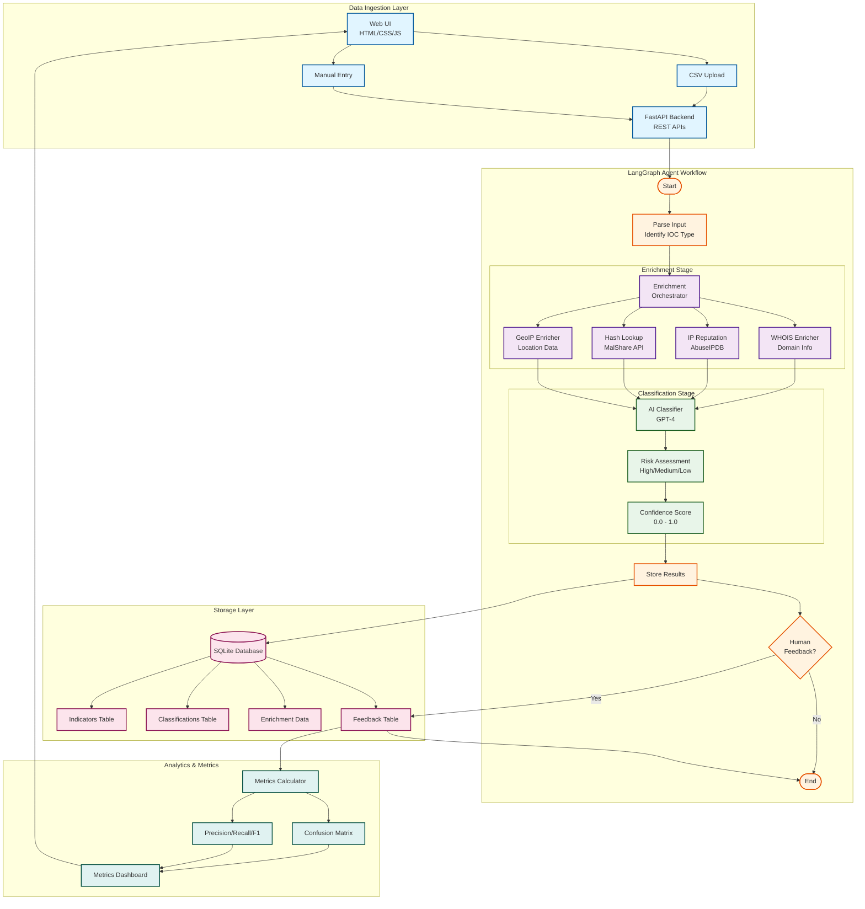

# 🛡️ Threat Analysis Agent

> **AI-Powered Threat Intelligence Platform with LangGraph Agent Architecture**

A production-ready threat analysis system that leverages OpenAI's GPT-4 and LangGraph to automatically classify, enrich, and assess cybersecurity indicators of compromise (IOCs).

[](https://www.python.org/)
[](https://fastapi.tiangolo.com/)
[](https://www.langchain.com/)
[](LICENSE)

---

## 📋 Table of Contents

- [Overview](#-overview)
- [Architecture](#-architecture)
- [Features](#-features)
- [Technology Stack](#-technology-stack)
- [Installation](#-installation)
- [Configuration](#-configuration)
- [Running the Application](#-running-the-application)
- [API Documentation](#-api-documentation)
- [Data Ingestion](#-data-ingestion)
- [Enrichment Sources](#-enrichment-sources)
- [Agent Graph Workflow](#-agent-graph-workflow)
- [Database Schema](#-database-schema)
- [Usage Examples](#-usage-examples)
- [Metrics & Analytics](#-metrics--analytics)
- [Troubleshooting](#-troubleshooting)
- [Development](#-development)
- [Contributing](#-contributing)
- [License](#-license)

---

## 🎯 Overview

The **Threat Analysis Agent** is an intelligent cybersecurity platform that automates the process of analyzing threat indicators using AI-powered classification and multi-source enrichment. Built on LangGraph's state machine architecture, it provides:

- **Automated IOC Classification**: AI-powered risk assessment using GPT-4
- **Multi-Source Enrichment**: WHOIS, IP reputation, hash lookup, and GeoIP data
- **RESTful API**: Complete REST API with Swagger documentation
- **Interactive Dashboard**: Web-based UI for manual indicator submission
- **Feedback Loop**: Human-in-the-loop validation for continuous improvement
- **Analytics Dashboard**: Real-time metrics with confusion matrix and performance indicators

### Use Cases

- **Security Operations Centers (SOCs)**: Automate initial triage of security alerts
- **Incident Response**: Quick assessment of IOCs during investigations
- **Threat Intelligence**: Enrich and classify threat feeds automatically
- **Security Research**: Analyze malware samples and suspicious indicators
- **Training & Education**: Learn about AI-driven security automation

---

## 🏗️ Architecture

### System Architecture Diagram



### Component Architecture

```
threat-analysis-agent/
│
├── app/
│   ├── main.py                    # FastAPI application & routes
│   ├── config.py                  # Configuration management
│   ├── logging_config.py          # Structured logging setup
│   │
│   ├── api/                       # REST API endpoints
│   │   ├── ingest.py             # Indicator ingestion APIs
│   │   ├── query.py              # Query & retrieval APIs
│   │   └── classify.py           # Classification APIs
│   │
│   ├── storage/                   # Data persistence layer
│   │   ├── db.py                 # Database connection
│   │   ├── models.py             # SQLAlchemy ORM models
│   │   └── repository.py         # Data access layer
│   │
│   ├── ingestion/                 # Data ingestion modules
│   │   ├── ingestor.py           # Base ingestion interface
│   │   └── csv_ingestor.py       # CSV file processing
│   │
│   ├── enrichment/                # Threat intelligence enrichment
│   │   ├── base.py               # Base enricher interface
│   │   ├── orchestrator.py       # Enrichment coordination
│   │   ├── whois_enricher.py     # WHOIS domain lookup
│   │   ├── ip_enricher.py        # IP reputation checking
│   │   ├── malshare_enricher.py  # Hash analysis
│   │   └── geoip_enricher.py     # Geolocation data
│   │
│   ├── classification/            # AI-powered classification
│   │   └── classifier.py         # OpenAI GPT-4 classifier
│   │
│   ├── langchain_graph/           # LangGraph agent implementation
│   │   └── graph_builder.py      # State machine workflow
│   │
│   └── utils/                     # Utility functions
│       ├── helpers.py            # Common utilities
│       └── exceptions.py         # Custom exceptions
│
├── ui/                            # Web interface
│   ├── index.html                # Main dashboard
│   ├── metrics.html              # Analytics page
│   ├── styles.css                # Styling
│   └── app.js                    # Frontend logic
│
├── config.yaml                    # Application configuration
├── requirements.txt               # Python dependencies
├── .env.example                  # Environment variables template
└── README.md                     # This file
```

---

## ✨ Features

### Core Capabilities

- **🤖 AI-Powered Classification**: GPT-4 analyzes indicators and assigns risk levels (High/Medium/Low)
- **🔍 Multi-Source Enrichment**: Automatically enriches IOCs with data from multiple threat intelligence sources
- **📊 Real-Time Analytics**: Track classification performance with confusion matrix and accuracy metrics
- **💾 Persistent Storage**: SQLite database for indicator storage and historical analysis
- **🌐 RESTful API**: Complete REST API with automatic Swagger documentation
- **🎨 Interactive Dashboard**: Clean, responsive web interface built with vanilla HTML/CSS/JS
- **🔄 Feedback Loop**: Human validation to improve classification accuracy over time
- **📝 Structured Logging**: JSON-formatted logs for easy parsing and monitoring
- **⚡ Async Processing**: Non-blocking operations for better performance
- **🔐 Type Safety**: Pydantic models for data validation

### Advanced Features

- **Batch Processing**: Upload CSV files with multiple indicators
- **Confidence Scoring**: Each classification includes a confidence score (0.0-1.0)
- **Historical Analysis**: Query past classifications and enrichment data
- **Rate Limiting**: Built-in protection for external API calls
- **Error Recovery**: Graceful handling of enrichment failures
- **Extensible Architecture**: Easy to add new enrichment sources or classifiers

---

## 🛠️ Technology Stack

### Backend

| Component | Technology | Purpose |
|-----------|-----------|---------|
| **Framework** | FastAPI | High-performance async web framework |
| **Agent** | LangGraph | State machine orchestration for LLM workflows |
| **LLM** | OpenAI GPT-4 | Natural language understanding & classification |
| **ORM** | SQLAlchemy | Database abstraction and models |
| **Database** | SQLite | Lightweight embedded database |
| **Validation** | Pydantic | Data validation and serialization |
| **Logging** | Python logging | Structured JSON logging |

### Frontend

| Component | Technology | Purpose |
|-----------|-----------|---------|
| **UI** | HTML5 | Semantic markup |
| **Styling** | CSS3 | Modern responsive design |
| **Scripting** | Vanilla JavaScript | Interactive functionality |
| **Charts** | Chart.js | Data visualization |

### External APIs

| Service | Purpose | Endpoint |
|---------|---------|----------|
| **WHOIS** | Domain registration info | python-whois library |
| **AbuseIPDB** | IP reputation scoring | https://api.abuseipdb.com/api/v2/check |
| **MalShare** | Malware hash lookup | https://malshare.com/api.php |
| **GeoIP** | IP geolocation | https://ipapi.co/{ip}/json/ |

---

## 📦 Installation

### Prerequisites

- **Python 3.9+** (Python 3.10+ recommended)
- **pip** (Python package manager)
- **OpenAI API Key** (for GPT-4 access)
- **Internet Connection** (for enrichment APIs)

### Step 1: Clone or Extract

```bash
# If cloning from repository
git clone <repository-url>
cd threat-analysis-agent

# If extracting from archive
tar -xzf threat_agent_complete.tar.gz
cd threat_agent_complete
```

### Step 2: Create Virtual Environment (Recommended)

```bash
# Create virtual environment
python -m venv venv

# Activate virtual environment
# On Linux/Mac:
source venv/bin/activate

# On Windows:
venv\Scripts\activate
```

### Step 3: Install Dependencies

```bash
# Install all required packages
pip install -r requirements.txt
```

### Step 4: Verify Installation

```bash
# Run verification script
python verify_installation.py
```

Expected output:
```
✅ All 45 required files found and verified!
✅ Installation is complete and ready to use!
```

---

## ⚙️ Configuration

### Environment Variables

Create a `.env` file in the project root:

```bash
# Copy example file
cp .env.example .env

# Edit with your API key
nano .env  # or use your preferred editor
```

**Required Configuration:**

```ini
# OpenAI API Key (REQUIRED for AI classification)
OPENAI_API_KEY=sk-proj-your-actual-openai-api-key-here

# Database Configuration (Optional - defaults work fine)
DATABASE_PATH=threat_intelligence.db

# API Configuration (Optional)
API_HOST=0.0.0.0
API_PORT=8000

# Logging Configuration (Optional)
LOG_LEVEL=INFO
LOG_FORMAT=json
```

### Getting an OpenAI API Key

1. Visit [OpenAI Platform](https://platform.openai.com/api-keys)
2. Sign in or create an account
3. Navigate to "API Keys" section
4. Click "Create new secret key"
5. Copy the key and paste it into your `.env` file

**Important**: Keep your API key secure and never commit it to version control!

### Configuration File

The `config.yaml` file contains additional settings:

```yaml
database:
  path: "threat_intelligence.db"
  echo: false

api:
  title: "Threat Analysis Agent API"
  version: "1.0.0"
  host: "0.0.0.0"
  port: 8000

openai:
  model: "gpt-4"
  temperature: 0.1
  max_tokens: 1000

enrichment:
  timeout: 30
  max_retries: 3
  enable_whois: true
  enable_ip_reputation: true
  enable_hash_lookup: true
  enable_geoip: true

logging:
  level: "INFO"
  format: "json"
  file: "threat_agent.log"
```

---

## 🚀 Running the Application

### Quick Start

```bash
# Start the FastAPI server
uvicorn app.main:app --reload
```

The application will start on `http://localhost:8000`

### Production Mode

```bash
# Run without auto-reload
uvicorn app.main:app --host 0.0.0.0 --port 8000

# Run with multiple workers
uvicorn app.main:app --host 0.0.0.0 --port 8000 --workers 4

# Run in background
nohup uvicorn app.main:app --host 0.0.0.0 --port 8000 > server.log 2>&1 &
```

### Access Points

Once running, access:

- **Main Dashboard**: http://localhost:8000
- **API Documentation**: http://localhost:8000/docs
- **Alternative API Docs**: http://localhost:8000/redoc
- **Metrics Dashboard**: http://localhost:8000/metrics.html
- **OpenAPI Spec**: http://localhost:8000/openapi.json

### Verification

Test the server is running:

```bash
# Health check
curl http://localhost:8000/health

# Expected response:
{"status": "healthy"}
```

---

## 📚 API Documentation

### Complete API Reference

The system provides a comprehensive REST API with automatic Swagger documentation.

#### Base URL

```
http://localhost:8000/api/v1
```

### Endpoints Overview

| Method | Endpoint | Description |
|--------|----------|-------------|
| **POST** | `/api/v1/ingest/single` | Submit single indicator |
| **POST** | `/api/v1/ingest/batch` | Upload CSV file with multiple indicators |
| **POST** | `/api/v1/classify/{indicator_id}` | Classify specific indicator |
| **GET** | `/api/v1/indicators` | List all indicators |
| **GET** | `/api/v1/indicators/{id}` | Get specific indicator |
| **GET** | `/api/v1/indicators/{id}/classification` | Get classification result |
| **POST** | `/api/v1/feedback` | Submit human feedback |
| **GET** | `/api/v1/metrics` | Get performance metrics |
| **GET** | `/health` | Health check |

---

### 1. Ingest Single Indicator

Submit a single indicator for analysis.

**Endpoint**: `POST /api/v1/ingest/single`

**Request Body**:
```json
{
  "value": "192.168.1.100",
  "type": "ip",
  "source": "manual",
  "metadata": {
    "severity": "high",
    "first_seen": "2024-10-22T10:00:00Z"
  }
}
```

**Response**:
```json
{
  "id": 1,
  "value": "192.168.1.100",
  "type": "ip",
  "source": "manual",
  "status": "pending",
  "created_at": "2024-10-22T10:00:00Z",
  "metadata": {
    "severity": "high",
    "first_seen": "2024-10-22T10:00:00Z"
  }
}
```

**cURL Example**:
```bash
curl -X POST http://localhost:8000/api/v1/ingest/single \
  -H "Content-Type: application/json" \
  -d '{
    "value": "192.168.1.100",
    "type": "ip",
    "source": "manual"
  }'
```

---

### 2. Batch Upload (CSV)

Upload a CSV file containing multiple indicators.

**Endpoint**: `POST /api/v1/ingest/batch`

**Request**: Multipart form data with file

**CSV Format**:
```csv
value,type,source,metadata
192.168.1.100,ip,firewall,"{\"severity\":\"high\"}"
example.com,domain,proxy,"{\"category\":\"phishing\"}"
44d88612fea8a8f36de82e1278abb02f,hash,endpoint,"{\"filename\":\"malware.exe\"}"
```

**Response**:
```json
{
  "total": 3,
  "successful": 3,
  "failed": 0,
  "indicators": [
    {
      "id": 1,
      "value": "192.168.1.100",
      "type": "ip",
      "status": "pending"
    },
    {
      "id": 2,
      "value": "example.com",
      "type": "domain",
      "status": "pending"
    },
    {
      "id": 3,
      "value": "44d88612fea8a8f36de82e1278abb02f",
      "type": "hash",
      "status": "pending"
    }
  ]
}
```

**cURL Example**:
```bash
curl -X POST http://localhost:8000/api/v1/ingest/batch \
  -F "file=@sample_indicators.csv"
```

---

### 3. Classify Indicator

Trigger AI classification for a specific indicator.

**Endpoint**: `POST /api/v1/classify/{indicator_id}`

**Path Parameters**:
- `indicator_id` (integer): ID of the indicator to classify

**Response**:
```json
{
  "id": 1,
  "indicator_id": 1,
  "classification": "malicious",
  "risk_score": 0.85,
  "confidence": 0.92,
  "reasoning": "IP address associated with known botnet activity. High abuse confidence score from reputation services.",
  "enrichment_data": {
    "whois": {
      "registrar": "Example Registrar",
      "creation_date": "2020-01-01"
    },
    "ip_reputation": {
      "abuse_confidence_score": 87,
      "total_reports": 45
    },
    "geoip": {
      "country": "RU",
      "city": "Moscow"
    }
  },
  "classified_at": "2024-10-22T10:05:00Z"
}
```

**cURL Example**:
```bash
curl -X POST http://localhost:8000/api/v1/classify/1
```

---

### 4. Query Indicators

Retrieve all indicators with optional filtering.

**Endpoint**: `GET /api/v1/indicators`

**Query Parameters**:
- `type` (string, optional): Filter by indicator type (ip, domain, hash, url)
- `classification` (string, optional): Filter by classification (malicious, benign, suspicious)
- `limit` (integer, optional): Number of results (default: 100)
- `offset` (integer, optional): Pagination offset (default: 0)

**Response**:
```json
{
  "total": 150,
  "limit": 100,
  "offset": 0,
  "indicators": [
    {
      "id": 1,
      "value": "192.168.1.100",
      "type": "ip",
      "source": "manual",
      "status": "classified",
      "classification": {
        "classification": "malicious",
        "risk_score": 0.85,
        "confidence": 0.92
      },
      "created_at": "2024-10-22T10:00:00Z"
    }
  ]
}
```

**cURL Examples**:
```bash
# Get all indicators
curl http://localhost:8000/api/v1/indicators

# Filter by type
curl http://localhost:8000/api/v1/indicators?type=ip

# Filter by classification
curl http://localhost:8000/api/v1/indicators?classification=malicious

# Pagination
curl http://localhost:8000/api/v1/indicators?limit=50&offset=100
```

---

### 5. Get Specific Indicator

Retrieve details of a specific indicator.

**Endpoint**: `GET /api/v1/indicators/{id}`

**Path Parameters**:
- `id` (integer): Indicator ID

**Response**:
```json
{
  "id": 1,
  "value": "192.168.1.100",
  "type": "ip",
  "source": "manual",
  "status": "classified",
  "metadata": {
    "severity": "high"
  },
  "enrichment_data": {
    "whois": {...},
    "ip_reputation": {...},
    "geoip": {...}
  },
  "classification": {
    "classification": "malicious",
    "risk_score": 0.85,
    "confidence": 0.92,
    "reasoning": "..."
  },
  "created_at": "2024-10-22T10:00:00Z",
  "updated_at": "2024-10-22T10:05:00Z"
}
```

**cURL Example**:
```bash
curl http://localhost:8000/api/v1/indicators/1
```

---

### 6. Submit Feedback

Provide human validation feedback on a classification.

**Endpoint**: `POST /api/v1/feedback`

**Request Body**:
```json
{
  "indicator_id": 1,
  "is_correct": true,
  "actual_classification": "malicious",
  "comments": "Confirmed through manual analysis"
}
```

**Response**:
```json
{
  "id": 1,
  "indicator_id": 1,
  "is_correct": true,
  "actual_classification": "malicious",
  "comments": "Confirmed through manual analysis",
  "submitted_at": "2024-10-22T10:10:00Z"
}
```

**cURL Example**:
```bash
curl -X POST http://localhost:8000/api/v1/feedback \
  -H "Content-Type: application/json" \
  -d '{
    "indicator_id": 1,
    "is_correct": true,
    "actual_classification": "malicious"
  }'
```

---

### 7. Get Metrics

Retrieve performance metrics and confusion matrix.

**Endpoint**: `GET /api/v1/metrics`

**Response**:
```json
{
  "total_classifications": 150,
  "total_feedback": 75,
  "accuracy": 0.92,
  "precision": 0.89,
  "recall": 0.94,
  "f1_score": 0.91,
  "confusion_matrix": {
    "true_positive": 65,
    "true_negative": 5,
    "false_positive": 3,
    "false_negative": 2
  },
  "by_classification": {
    "malicious": {
      "total": 80,
      "correct": 75,
      "accuracy": 0.94
    },
    "benign": {
      "total": 50,
      "correct": 45,
      "accuracy": 0.90
    },
    "suspicious": {
      "total": 20,
      "correct": 18,
      "accuracy": 0.90
    }
  }
}
```

**cURL Example**:
```bash
curl http://localhost:8000/api/v1/metrics
```

---

### Error Responses

All endpoints return standard HTTP status codes:

**400 Bad Request**:
```json
{
  "detail": "Invalid indicator type. Must be one of: ip, domain, hash, url"
}
```

**404 Not Found**:
```json
{
  "detail": "Indicator with ID 999 not found"
}
```

**500 Internal Server Error**:
```json
{
  "detail": "Classification failed: OpenAI API error"
}
```

---

## 📥 Data Ingestion

The system supports multiple methods for ingesting threat indicators.

### Method 1: Web Dashboard (Manual)

1. Navigate to http://localhost:8000
2. Click "Add Single Indicator"
3. Fill in the form:
   - **Value**: The indicator value (IP, domain, hash, URL)
   - **Type**: Select from dropdown (ip, domain, hash, url)
   - **Source**: Origin of the indicator (e.g., "firewall", "ids", "manual")
4. Click "Submit"
5. The indicator will be automatically classified

### Method 2: CSV Upload (Batch)

**CSV Format**:
```csv
value,type,source,metadata
192.168.1.100,ip,firewall,"{\"severity\":\"high\"}"
example.com,domain,proxy,"{\"category\":\"phishing\"}"
44d88612fea8a8f36de82e1278abb02f,hash,endpoint,"{\"filename\":\"malware.exe\"}"
```

**Via Web UI**:
1. Navigate to http://localhost:8000
2. Click "Upload CSV"
3. Select your CSV file
4. Click "Upload"
5. All indicators will be processed automatically

**Via cURL**:
```bash
curl -X POST http://localhost:8000/api/v1/ingest/batch \
  -F "file=@your_indicators.csv"
```

### Method 3: REST API (Programmatic)

**Python Example**:
```python
import requests

# Single indicator
response = requests.post(
    "http://localhost:8000/api/v1/ingest/single",
    json={
        "value": "192.168.1.100",
        "type": "ip",
        "source": "python_script"
    }
)
indicator = response.json()
print(f"Indicator ID: {indicator['id']}")

# Batch upload
with open("indicators.csv", "rb") as f:
    response = requests.post(
        "http://localhost:8000/api/v1/ingest/batch",
        files={"file": f}
    )
    result = response.json()
    print(f"Uploaded {result['successful']} indicators")
```

**JavaScript Example**:
```javascript
// Single indicator
fetch('http://localhost:8000/api/v1/ingest/single', {
    method: 'POST',
    headers: {
        'Content-Type': 'application/json'
    },
    body: JSON.stringify({
        value: '192.168.1.100',
        type: 'ip',
        source: 'javascript_app'
    })
})
.then(response => response.json())
.then(data => console.log('Indicator ID:', data.id));

// CSV upload
const formData = new FormData();
formData.append('file', fileInput.files[0]);

fetch('http://localhost:8000/api/v1/ingest/batch', {
    method: 'POST',
    body: formData
})
.then(response => response.json())
.then(data => console.log(`Uploaded ${data.successful} indicators`));
```

### Method 4: Integration with SIEM/SOAR

**Splunk Integration Example**:
```python
# Splunk alert action script
import sys
import requests

# Read alert data from stdin
alert_data = sys.stdin.read()
indicator = extract_indicator(alert_data)

# Send to Threat Analysis Agent
requests.post(
    "http://threat-agent:8000/api/v1/ingest/single",
    json={
        "value": indicator,
        "type": "ip",
        "source": "splunk_alert",
        "metadata": {
            "alert_id": alert_data['sid'],
            "severity": alert_data['severity']
        }
    }
)
```

**Sample Data**

A sample CSV file is provided: `sample_indicators.csv`

```csv
value,type,source,metadata
8.8.8.8,ip,test,"{\"note\":\"Google DNS\"}"
malicious-site.com,domain,test,"{\"note\":\"Known phishing\"}"
44d88612fea8a8f36de82e1278abb02f,hash,test,"{\"note\":\"Test malware hash\"}"
```

---

## 🔍 Enrichment Sources

The system automatically enriches indicators with data from multiple sources.

### 1. WHOIS Enrichment

**Provider**: Python-whois library  
**Applies To**: Domain indicators  
**Data Collected**:
- Domain registrar
- Registration date
- Expiration date
- Name servers
- Registrant information (if public)

**Example Output**:
```json
{
  "registrar": "GoDaddy.com, LLC",
  "creation_date": "2020-01-15T00:00:00",
  "expiration_date": "2025-01-15T00:00:00",
  "name_servers": ["ns1.example.com", "ns2.example.com"],
  "status": "active"
}
```

**Rate Limits**: None (local library)  
**Fallback**: Returns empty dict if lookup fails

---

### 2. IP Reputation (AbuseIPDB)

**Provider**: AbuseIPDB API  
**Endpoint**: https://api.abuseipdb.com/api/v2/check  
**Applies To**: IP address indicators  
**API Key**: Not required (uses public endpoint with limits)

**Data Collected**:
- Abuse confidence score (0-100)
- Total number of reports
- Country code
- ISP information
- Last reported date

**Example Output**:
```json
{
  "abuseConfidenceScore": 87,
  "totalReports": 45,
  "countryCode": "CN",
  "usageType": "Data Center/Web Hosting/Transit",
  "isp": "Example ISP",
  "lastReportedAt": "2024-10-22T09:30:00+00:00"
}
```

**Rate Limits**: 1,000 requests/day (free tier)  
**Fallback**: Returns empty dict if API unavailable

---

### 3. Hash Lookup (MalShare)

**Provider**: MalShare API  
**Endpoint**: https://malshare.com/api.php  
**Applies To**: File hash indicators (MD5, SHA1, SHA256)  
**API Key**: Not required for hash lookup

**Data Collected**:
- File type/format
- Detection status
- Malware family (if known)
- First seen date
- Sample availability

**Example Output**:
```json
{
  "md5": "44d88612fea8a8f36de82e1278abb02f",
  "sha1": "3395856ce81f2b7382dee72602f798b642f14140",
  "sha256": "275a021bbfb6489e54d471899f7db9d1663fc695ec2fe2a2c4538aabf651fd0f",
  "type": "PE32 executable",
  "detected": true,
  "family": "GenericTrojan"
}
```

**Rate Limits**: Varies by API key tier  
**Fallback**: Returns basic hash info if not found in database

---

### 4. GeoIP Location

**Provider**: ipapi.co  
**Endpoint**: https://ipapi.co/{ip}/json/  
**Applies To**: IP address indicators  
**API Key**: Not required (free tier)

**Data Collected**:
- Country, city, region
- Latitude/longitude
- Time zone
- ASN information
- Organization name

**Example Output**:
```json
{
  "ip": "192.168.1.100",
  "city": "San Francisco",
  "region": "California",
  "country": "US",
  "country_name": "United States",
  "latitude": 37.7749,
  "longitude": -122.4194,
  "timezone": "America/Los_Angeles",
  "asn": "AS15169",
  "org": "Google LLC"
}
```

**Rate Limits**: 1,000 requests/day (free tier)  
**Fallback**: Returns empty dict if API unavailable

---

### Enrichment Configuration

Control which enrichers are enabled in `config.yaml`:

```yaml
enrichment:
  timeout: 30  # Seconds to wait for each enricher
  max_retries: 3  # Number of retry attempts
  enable_whois: true
  enable_ip_reputation: true
  enable_hash_lookup: true
  enable_geoip: true
```

### Adding Custom Enrichers

To add a new enrichment source:

1. Create a new enricher class in `app/enrichment/`:

```python
# app/enrichment/my_enricher.py
from app.enrichment.base import BaseEnricher

class MyCustomEnricher(BaseEnricher):
    async def enrich(self, indicator_value: str, indicator_type: str) -> dict:
        # Your enrichment logic here
        if indicator_type != "ip":
            return {}
        
        # Call your API
        data = await self.call_api(indicator_value)
        return data
```

2. Register it in the orchestrator (`app/enrichment/orchestrator.py`):

```python
from app.enrichment.my_enricher import MyCustomEnricher

self.enrichers = [
    WhoisEnricher(),
    IPReputationEnricher(),
    MalShareEnricher(),
    GeoIPEnricher(),
    MyCustomEnricher(),  # Add your enricher
]
```

---

## 🤖 Agent Graph Workflow

The system uses **LangGraph** to orchestrate the analysis workflow as a state machine.

### State Machine Overview

```
┌─────────────┐
│   START     │
└──────┬──────┘
       │
       ▼
┌─────────────┐
│ PARSE INPUT │ ← Identify IOC type
└──────┬──────┘
       │
       ▼
┌─────────────────────────────────┐
│   ENRICHMENT ORCHESTRATOR       │
├─────────────────────────────────┤
│  • WHOIS Lookup (domains)       │
│  • IP Reputation (IPs)          │
│  • Hash Lookup (file hashes)    │
│  • GeoIP Location (IPs)         │
└────────────┬────────────────────┘
             │
             ▼
┌─────────────────────────────────┐
│   AI CLASSIFICATION (GPT-4)     │
├─────────────────────────────────┤
│  Inputs:                        │
│  • Indicator value & type       │
│  • Enrichment data              │
│  Outputs:                       │
│  • Classification (malicious/   │
│    benign/suspicious)           │
│  • Risk score (0.0-1.0)         │
│  • Confidence (0.0-1.0)         │
│  • Reasoning                    │
└────────────┬────────────────────┘
             │
             ▼
┌─────────────────────────────────┐
│      STORE RESULTS              │
└────────────┬────────────────────┘
             │
             ▼
┌─────────────────────────────────┐
│    HUMAN FEEDBACK? (Optional)   │
└────────────┬────────────────────┘
             │
             ▼
┌─────────────┐
│     END     │
└─────────────┘
```

### LangGraph Implementation

**Key Components**:

1. **State Definition** (`app/langchain_graph/graph_builder.py`):
```python
class AgentState(TypedDict):
    indicator_id: int
    indicator_value: str
    indicator_type: str
    enrichment_data: dict
    classification: Optional[str]
    risk_score: Optional[float]
    confidence: Optional[float]
    reasoning: Optional[str]
    error: Optional[str]
```

2. **Node Functions**:
   - `parse_input_node`: Validates and extracts indicator information
   - `enrich_node`: Orchestrates all enrichment sources
   - `classify_node`: Calls GPT-4 for classification
   - `store_results_node`: Persists results to database

3. **Graph Construction**:
```python
workflow = StateGraph(AgentState)

# Add nodes
workflow.add_node("parse", parse_input_node)
workflow.add_node("enrich", enrich_node)
workflow.add_node("classify", classify_node)
workflow.add_node("store", store_results_node)

# Define edges
workflow.set_entry_point("parse")
workflow.add_edge("parse", "enrich")
workflow.add_edge("enrich", "classify")
workflow.add_edge("classify", "store")
workflow.add_edge("store", END)

# Compile
app = workflow.compile()
```

### AI Classification Prompt

The GPT-4 model receives this structured prompt:

```
You are a cybersecurity threat analyst. Analyze the following indicator and classify it.

Indicator Value: {indicator_value}
Indicator Type: {indicator_type}

Enrichment Data:
{enrichment_data}

Provide your analysis in the following format:
1. Classification: One of [malicious, benign, suspicious]
2. Risk Score: A float between 0.0 (no risk) and 1.0 (critical risk)
3. Confidence: Your confidence in this classification (0.0 to 1.0)
4. Reasoning: Detailed explanation of your classification

Consider:
- Reputation scores and historical data
- Geographic origin and hosting information
- Domain registration details
- Known malware signatures
- Behavioral indicators
```

**Model Configuration**:
- Model: `gpt-4`
- Temperature: `0.1` (low for consistent, focused outputs)
- Max Tokens: `1000`
- Response Format: Structured JSON

---

## 💾 Database Schema

The system uses SQLite with the following schema:

### Tables

#### 1. `indicators`
Stores all ingested threat indicators.

```sql
CREATE TABLE indicators (
    id INTEGER PRIMARY KEY AUTOINCREMENT,
    value TEXT NOT NULL,
    type TEXT NOT NULL,  -- 'ip', 'domain', 'hash', 'url'
    source TEXT NOT NULL,  -- Origin of indicator
    status TEXT DEFAULT 'pending',  -- 'pending', 'enriched', 'classified'
    metadata JSON,  -- Additional metadata
    enrichment_data JSON,  -- Data from enrichers
    created_at TIMESTAMP DEFAULT CURRENT_TIMESTAMP,
    updated_at TIMESTAMP DEFAULT CURRENT_TIMESTAMP
);

CREATE INDEX idx_indicators_value ON indicators(value);
CREATE INDEX idx_indicators_type ON indicators(type);
CREATE INDEX idx_indicators_status ON indicators(status);
```

#### 2. `classifications`
Stores AI classification results.

```sql
CREATE TABLE classifications (
    id INTEGER PRIMARY KEY AUTOINCREMENT,
    indicator_id INTEGER NOT NULL,
    classification TEXT NOT NULL,  -- 'malicious', 'benign', 'suspicious'
    risk_score REAL NOT NULL,  -- 0.0 to 1.0
    confidence REAL NOT NULL,  -- 0.0 to 1.0
    reasoning TEXT,  -- AI's explanation
    classified_at TIMESTAMP DEFAULT CURRENT_TIMESTAMP,
    FOREIGN KEY (indicator_id) REFERENCES indicators(id)
);

CREATE INDEX idx_classifications_indicator ON classifications(indicator_id);
CREATE INDEX idx_classifications_classification ON classifications(classification);
```

#### 3. `feedback`
Stores human validation feedback.

```sql
CREATE TABLE feedback (
    id INTEGER PRIMARY KEY AUTOINCREMENT,
    indicator_id INTEGER NOT NULL,
    is_correct BOOLEAN NOT NULL,  -- Was AI classification correct?
    actual_classification TEXT,  -- Human's classification if AI was wrong
    comments TEXT,  -- Additional notes
    submitted_at TIMESTAMP DEFAULT CURRENT_TIMESTAMP,
    FOREIGN KEY (indicator_id) REFERENCES indicators(id)
);

CREATE INDEX idx_feedback_indicator ON feedback(indicator_id);
```

### Entity Relationships

```
indicators (1) ──────< (1) classifications
     │
     └──────< (many) feedback
```

### Sample Queries

```sql
-- Get all malicious IPs
SELECT i.value, c.risk_score, c.confidence
FROM indicators i
JOIN classifications c ON i.id = c.indicator_id
WHERE i.type = 'ip' AND c.classification = 'malicious'
ORDER BY c.risk_score DESC;

-- Calculate accuracy by indicator type
SELECT 
    i.type,
    COUNT(*) as total,
    SUM(CASE WHEN f.is_correct = 1 THEN 1 ELSE 0 END) as correct,
    ROUND(AVG(CASE WHEN f.is_correct = 1 THEN 1.0 ELSE 0.0 END) * 100, 2) as accuracy
FROM indicators i
JOIN classifications c ON i.id = c.indicator_id
JOIN feedback f ON i.id = f.indicator_id
GROUP BY i.type;

-- Get indicators with low confidence that need review
SELECT i.value, i.type, c.classification, c.confidence
FROM indicators i
JOIN classifications c ON i.id = c.indicator_id
WHERE c.confidence < 0.7
ORDER BY c.confidence ASC;
```

---

## 📖 Usage Examples

### Example 1: Analyzing a Suspicious IP

```bash
# 1. Submit IP for analysis
curl -X POST http://localhost:8000/api/v1/ingest/single \
  -H "Content-Type: application/json" \
  -d '{
    "value": "185.220.101.1",
    "type": "ip",
    "source": "firewall_alert"
  }'

# Response: {"id": 1, "value": "185.220.101.1", ...}

# 2. Trigger classification
curl -X POST http://localhost:8000/api/v1/classify/1

# 3. View results
curl http://localhost:8000/api/v1/indicators/1

# Example response showing enrichment + classification:
{
  "id": 1,
  "value": "185.220.101.1",
  "type": "ip",
  "enrichment_data": {
    "ip_reputation": {
      "abuseConfidenceScore": 92,
      "totalReports": 156
    },
    "geoip": {
      "country": "NL",
      "city": "Amsterdam",
      "org": "Suspicious Hosting Ltd"
    }
  },
  "classification": {
    "classification": "malicious",
    "risk_score": 0.92,
    "confidence": 0.95,
    "reasoning": "High abuse confidence score (92/100) with 156 reports. Associated with known malicious hosting provider."
  }
}
```

### Example 2: Batch Analysis from CSV

```python
# create_report.py
import requests
import pandas as pd
from datetime import datetime

# Upload indicators
with open('daily_indicators.csv', 'rb') as f:
    response = requests.post(
        'http://localhost:8000/api/v1/ingest/batch',
        files={'file': f}
    )
    
result = response.json()
print(f"Processed {result['successful']} indicators")

# Wait for classification (in production, use webhooks/callbacks)
import time
time.sleep(5)

# Get all malicious indicators
response = requests.get(
    'http://localhost:8000/api/v1/indicators',
    params={'classification': 'malicious'}
)

malicious = response.json()

# Generate report
report = pd.DataFrame(malicious['indicators'])
report.to_csv(f'malicious_report_{datetime.now().strftime("%Y%m%d")}.csv')
print(f"Report generated with {len(report)} malicious indicators")
```

### Example 3: Integration with Python

```python
# threat_hunter.py
import requests
from typing import List, Dict

class ThreatAnalysisClient:
    def __init__(self, base_url: str = "http://localhost:8000"):
        self.base_url = base_url
        
    def analyze_indicator(self, value: str, type: str, source: str = "api") -> Dict:
        """Submit and classify a single indicator."""
        # Ingest
        response = requests.post(
            f"{self.base_url}/api/v1/ingest/single",
            json={"value": value, "type": type, "source": source}
        )
        indicator = response.json()
        
        # Classify
        requests.post(f"{self.base_url}/api/v1/classify/{indicator['id']}")
        
        # Get results
        response = requests.get(
            f"{self.base_url}/api/v1/indicators/{indicator['id']}"
        )
        return response.json()
    
    def batch_analyze(self, indicators: List[Dict]) -> List[Dict]:
        """Analyze multiple indicators."""
        results = []
        for ind in indicators:
            result = self.analyze_indicator(
                value=ind['value'],
                type=ind['type'],
                source=ind.get('source', 'batch')
            )
            results.append(result)
        return results
    
    def get_malicious_indicators(self) -> List[Dict]:
        """Get all indicators classified as malicious."""
        response = requests.get(
            f"{self.base_url}/api/v1/indicators",
            params={"classification": "malicious"}
        )
        return response.json()['indicators']

# Usage
client = ThreatAnalysisClient()

# Analyze single indicator
result = client.analyze_indicator("evil.com", "domain", "threat_intel_feed")
print(f"Risk Score: {result['classification']['risk_score']}")

# Batch analysis
suspicious_ips = [
    {"value": "192.168.1.100", "type": "ip"},
    {"value": "10.0.0.50", "type": "ip"},
]
results = client.batch_analyze(suspicious_ips)

# Get all malicious finds
threats = client.get_malicious_indicators()
for threat in threats:
    print(f"⚠️ {threat['value']} - Risk: {threat['classification']['risk_score']}")
```

---

## 📊 Metrics & Analytics

### Metrics Dashboard

Access at: http://localhost:8000/metrics.html

**Displays**:
- **Confusion Matrix**: Visual representation of classification accuracy
- **Precision**: Percentage of true positives among all positive predictions
- **Recall**: Percentage of actual positives correctly identified
- **F1 Score**: Harmonic mean of precision and recall
- **Accuracy by Type**: Breakdown by indicator type (IP, domain, hash)

### Confusion Matrix

```
                  Predicted
                Mal   Ben   Sus
    Actual Mal   TP    FN    FN
           Ben   FP    TN    FN
           Sus   FP    FN    TP
```

Where:
- **TP (True Positive)**: Correctly identified as malicious
- **TN (True Negative)**: Correctly identified as benign
- **FP (False Positive)**: Incorrectly identified as malicious
- **FN (False Negative)**: Incorrectly identified as benign

### Metrics API

**Endpoint**: `GET /api/v1/metrics`

**Response**:
```json
{
  "total_classifications": 500,
  "total_feedback": 250,
  "accuracy": 0.94,
  "precision": 0.91,
  "recall": 0.96,
  "f1_score": 0.93,
  "confusion_matrix": {
    "true_positive": 200,
    "true_negative": 35,
    "false_positive": 10,
    "false_negative": 5
  },
  "by_type": {
    "ip": {"accuracy": 0.95, "total": 200},
    "domain": {"accuracy": 0.93, "total": 150},
    "hash": {"accuracy": 0.92, "total": 100},
    "url": {"accuracy": 0.90, "total": 50}
  }
}
```

---

## 🔧 Troubleshooting

### Common Issues

#### 1. OpenAI API Key Error

**Error**: `openai.error.AuthenticationError: Invalid API key`

**Solution**:
```bash
# Check your .env file
cat .env | grep OPENAI_API_KEY

# Verify format (should start with sk-proj- or sk-)
# Make sure there are no extra spaces or quotes

# Restart the server after fixing
uvicorn app.main:app --reload
```

#### 2. Database Locked Error

**Error**: `sqlite3.OperationalError: database is locked`

**Solution**:
```bash
# Stop all running instances
pkill -f uvicorn

# Remove lock file if it exists
rm threat_intelligence.db-journal

# Restart
uvicorn app.main:app --reload
```

#### 3. SSL Certificate Error (MalShare)

**Error**: `ssl.SSLError: certificate verify failed`

**Solution**: Already handled in code with SSL context bypass for MalShare API.

If still occurring:
```python
# In app/enrichment/malshare_enricher.py
ssl_context = ssl.create_default_context()
ssl_context.check_hostname = False
ssl_context.verify_mode = ssl.CERT_NONE
```

#### 4. Port Already in Use

**Error**: `OSError: [Errno 48] Address already in use`

**Solution**:
```bash
# Find process using port 8000
lsof -i :8000

# Kill the process
kill -9 <PID>

# Or use a different port
uvicorn app.main:app --port 8001
```

#### 5. Missing Dependencies

**Error**: `ModuleNotFoundError: No module named 'xxx'`

**Solution**:
```bash
# Reinstall all dependencies
pip install -r requirements.txt --force-reinstall

# Or install specific package
pip install xxx
```

### Logging

Check logs for debugging:

```bash
# View real-time logs
tail -f threat_agent.log

# Search for errors
grep "ERROR" threat_agent.log

# View JSON logs
cat threat_agent.log | jq '.level == "ERROR"'
```

### Testing

Run test suites to verify functionality:

```bash
# Test foundation
python test_foundation.py

# Test ingestion
python test_phase2.py

# Test enrichment
python test_phase3.py

# Test classification
python test_phase4.py
```

---

## 👨‍💻 Development

### Project Structure Philosophy

- **Modular Design**: Each component is independent and testable
- **Separation of Concerns**: API, business logic, and data layers are distinct
- **Type Safety**: Pydantic models for validation
- **Async First**: Non-blocking I/O for better performance
- **Configuration-Driven**: Easy to modify behavior without code changes

### Adding New Features

**1. New Enrichment Source**:
```python
# app/enrichment/new_enricher.py
from app.enrichment.base import BaseEnricher

class NewEnricher(BaseEnricher):
    async def enrich(self, value: str, type: str) -> dict:
        if type != "ip":
            return {}
        # Your enrichment logic
        return {"new_data": "value"}
```

**2. New API Endpoint**:
```python
# app/api/new_endpoint.py
from fastapi import APIRouter

router = APIRouter()

@router.get("/custom")
async def custom_endpoint():
    return {"message": "Custom endpoint"}
```

**3. Custom Classifier**:
```python
# app/classification/custom_classifier.py
from app.classification.classifier import ClassificationResult

class CustomClassifier:
    async def classify(self, indicator: dict) -> ClassificationResult:
        # Your classification logic
        return ClassificationResult(
            classification="malicious",
            risk_score=0.8,
            confidence=0.9,
            reasoning="Custom logic"
        )
```

### Code Style

Follow PEP 8 and use type hints:

```python
from typing import List, Dict, Optional

async def process_indicators(
    indicators: List[Dict],
    batch_size: int = 100
) -> Dict[str, int]:
    """
    Process indicators in batches.
    
    Args:
        indicators: List of indicator dictionaries
        batch_size: Number of indicators per batch
        
    Returns:
        Dictionary with processing statistics
    """
    # Implementation
    pass
```

### Running Tests

```bash
# Run all tests
pytest

# Run with coverage
pytest --cov=app --cov-report=html

# Run specific test
pytest tests/test_enrichment.py -v
```

---

## 🤝 Contributing

Contributions are welcome! Please follow these guidelines:

1. **Fork the repository**
2. **Create a feature branch**: `git checkout -b feature/amazing-feature`
3. **Make your changes**
4. **Add tests** for new functionality
5. **Ensure tests pass**: `pytest`
6. **Format code**: `black app/ && isort app/`
7. **Commit changes**: `git commit -m 'Add amazing feature'`
8. **Push to branch**: `git push origin feature/amazing-feature`
9. **Open a Pull Request**

### Contribution Ideas

- [ ] Add support for more enrichment sources (VirusTotal, Shodan, etc.)
- [ ] Implement scheduled autonomous scanning
- [ ] Add email/Slack notifications
- [ ] Create Docker containerization
- [ ] Build report generation (PDF exports)
- [ ] Add user authentication and RBAC
- [ ] Implement API rate limiting
- [ ] Add more visualization charts
- [ ] Support for more IOC types (URLs, email addresses)
- [ ] Integration with MISP threat sharing platform

---

## 📄 License

This project is licensed under the MIT License - see the LICENSE file for details.

```
MIT License

Copyright (c) 2024 Threat Analysis Agent

Permission is hereby granted, free of charge, to any person obtaining a copy
of this software and associated documentation files (the "Software"), to deal
in the Software without restriction, including without limitation the rights
to use, copy, modify, merge, publish, distribute, sublicense, and/or sell
copies of the Software, and to permit persons to whom the Software is
furnished to do so, subject to the following conditions:

The above copyright notice and this permission notice shall be included in all
copies or substantial portions of the Software.

THE SOFTWARE IS PROVIDED "AS IS", WITHOUT WARRANTY OF ANY KIND, EXPRESS OR
IMPLIED, INCLUDING BUT NOT LIMITED TO THE WARRANTIES OF MERCHANTABILITY,
FITNESS FOR A PARTICULAR PURPOSE AND NONINFRINGEMENT. IN NO EVENT SHALL THE
AUTHORS OR COPYRIGHT HOLDERS BE LIABLE FOR ANY CLAIM, DAMAGES OR OTHER
LIABILITY, WHETHER IN AN ACTION OF CONTRACT, TORT OR OTHERWISE, ARISING FROM,
OUT OF OR IN CONNECTION WITH THE SOFTWARE OR THE USE OR OTHER DEALINGS IN THE
SOFTWARE.
```

---

## 📞 Support

For questions, issues, or suggestions:

- **GitHub Issues**: [Create an issue](https://github.com/your-repo/issues)
- **Documentation**: This README
- **Email**: support@threat-agent.example.com

---

## 🎓 Acknowledgments

- **LangChain/LangGraph**: For the state machine framework
- **OpenAI**: For GPT-4 API
- **FastAPI**: For the excellent web framework
- **AbuseIPDB, MalShare, ipapi.co**: For free threat intelligence APIs

---

## 🚀 Future Roadmap

### Phase 1 (Current)
- ✅ Core ingestion and classification
- ✅ Basic enrichment sources
- ✅ Web dashboard
- ✅ REST API
- ✅ Feedback system

### Phase 2 (Q1 2025)
- [ ] Autonomous scheduled scanning
- [ ] Email/Slack notifications
- [ ] Enhanced metrics dashboard
- [ ] API authentication
- [ ] Rate limiting

### Phase 3 (Q2 2025)
- [ ] Docker containerization
- [ ] Kubernetes deployment
- [ ] Advanced threat hunting features
- [ ] MISP integration
- [ ] Multi-tenant support

### Phase 4 (Q3 2025)
- [ ] Machine learning model training
- [ ] Custom rule engine
- [ ] Advanced analytics
- [ ] Mobile application
- [ ] Enterprise SSO integration

---

## 📚 Additional Resources

### Documentation
- [FastAPI Docs](https://fastapi.tiangolo.com/)
- [LangChain Docs](https://python.langchain.com/)
- [SQLAlchemy Docs](https://docs.sqlalchemy.org/)
- [OpenAI API Docs](https://platform.openai.com/docs/)

### Threat Intelligence
- [MITRE ATT&CK](https://attack.mitre.org/)
- [STIX/TAXII](https://oasis-open.github.io/cti-documentation/)
- [NIST Cybersecurity Framework](https://www.nist.gov/cyberframework)

### Security Best Practices
- [OWASP Top 10](https://owasp.org/www-project-top-ten/)
- [CIS Controls](https://www.cisecurity.org/controls/)

---

<div align="center">

**Built with ❤️ for the Cybersecurity Community**

[](https://github.com/your-repo)
[](https://docs.threat-agent.example.com)
[](http://localhost:8000/docs)

</div>

---

**Happy Threat Hunting! 🔍🛡️**