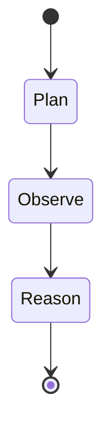
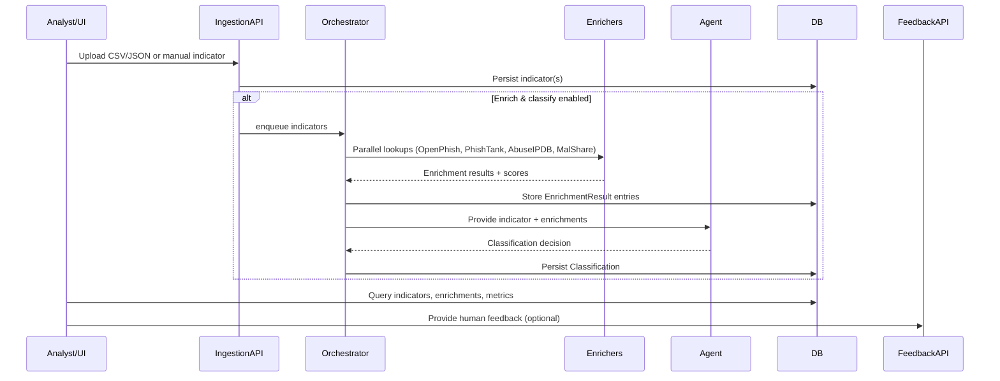

# 🛡️ Threat Analysis Agent

> **AI-assisted threat intelligence pipeline powered by FastAPI, LangGraph, and multi-source enrichment.**

[](https://www.python.org/)
[](https://fastapi.tiangolo.com/)
[](https://langchain.com/)
[](LICENSE)

---

## 📚 Table of Contents

- [Overview](#-overview)
- [Highlights](#-highlights)
- [Architecture](#-architecture)
- [LangGraph Agent Workflow](#-langgraph-agent-workflow)
- [Data Pipeline](#-data-pipeline)
- [Technology Stack](#-technology-stack)
- [Setup](#-setup)
  - [Prerequisites](#prerequisites)
  - [Installation](#installation)
  - [Configuration](#configuration)
  - [Run the App](#run-the-app)
- [Sample Data & Quickstart](#-sample-data--quickstart)
- [API Surface](#-api-surface)
- [User Interface & Metrics](#-user-interface--metrics)
- [Testing](#-testing)
- [Troubleshooting](#-troubleshooting)
- [Contributing](#-contributing)
- [License](#-license)

---

## 🎯 Overview

The **Threat Analysis Agent** is an end-to-end threat intelligence application that ingests suspicious indicators of compromise (IOCs), enriches them with live intelligence feeds, and drives AI-assisted classification via LangGraph. The platform exposes both a REST API and a responsive web UI, enabling security analysts to triage alerts, monitor classification accuracy, and keep a human-in-the-loop feedback cycle.

Key capabilities include:

- Automated enrichment across **OpenPhish**, **PhishTank**, **AbuseIPDB**, and **MalShare**
- LangGraph-powered analysis agent that reasons over enrichment signals before issuing a verdict
- Persistent storage for indicators, enrichments, classifications, and analyst feedback
- CSV/JSON bulk ingestion as well as single indicator submission
- Dashboard with live metrics, confusion matrix, and per-indicator drill-down

---

## ✨ Highlights

- **Production-ready FastAPI backend** with modular routers for ingestion, classification, querying, and feedback.
- **Async enrichment orchestrator** that fans out requests, retries on failure, and persists results transactionally.
- **LangGraph threat analysis agent** (Plan → Observe → Reason) with GPT-based reasoning and policy-aligned risk scoring.
- **Static web UI** bundled with the API, offering drag-and-drop uploads, feedback capture, and indicator details.
- **Configurable via `config.yaml` + `.env`**, with sensible defaults and optional schedulers.
- **Realistic datasets** and scripts for quick experimentation, housed under `Data/` and repository root.

---

## 🏗️ Architecture

### System Overview

```mermaid
flowchart TD
    subgraph Client
        UI[Web UI\n(ui/index.html, app.js)]
        APIClient[External Clients\n(cURL, integrations)]
    end

    subgraph Backend[FastAPI Application]
        IngestAPI[/Ingestion Router/]
        QueryAPI[/Query Router/]
        ClassifyAPI[/Classification Router/]
        FeedbackAPI[/Feedback Router/]
    end

    subgraph Pipeline[Processing]
        Orchestrator[Async Enrichment\nOrchestrator]
        OpenPhish[OpenPhish\nFeed]
        PhishTank[PhishTank\nFeed]
        AbuseIPDB[AbuseIPDB\nReputation]
        MalShare[MalShare\nHash Intel]
        ThreatAgent[LangGraph\nThreatAnalysisAgent]
        Classifier[ThreatClassifier]
    end

    subgraph Storage[Persistence]
        DB[(SQLite\nthreat_intelligence.db)]
        Indicators[(indicators)]
        Enrichments[(enrichments)]
        Classifications[(classifications)]
        Feedback[(feedback)]
    end

    subgraph Analytics
        Metrics[Metrics Service]
        Dashboard[UI Metrics Widgets]
    end

    UI -->|Uploads/Queries| IngestAPI
    UI --> QueryAPI
    UI --> FeedbackAPI
    APIClient --> IngestAPI
    APIClient --> QueryAPI
    IngestAPI --> Orchestrator
    Orchestrator --> OpenPhish
    Orchestrator --> PhishTank
    Orchestrator --> AbuseIPDB
    Orchestrator --> MalShare
    Orchestrator --> DB
    Orchestrator --> Classifier
    Classifier --> ThreatAgent
    ThreatAgent --> Classifier
    Classifier --> DB
    Classifier --> Metrics
    QueryAPI --> DB
    FeedbackAPI --> Feedback
    Feedback --> Metrics
    Metrics --> Dashboard
    Dashboard --> UI
```

### Component Map

```
threat-analysis-agent/
│
├── app/
│   ├── main.py                     # FastAPI entry point and startup wiring
│   ├── config.py                   # Pydantic settings + YAML loader
│   ├── logging_config.py           # Structured logging setup
│   │
│   ├── api/
│   │   ├── ingest.py               # CSV/JSON upload & manual submission endpoints
│   │   ├── query.py                # Indicator search, details, and enrichment summaries
│   │   ├── classify.py             # On-demand classification triggers
│   │   └── feedback.py             # Analyst feedback capture & retrieval
│   │
│   ├── ingestion/
│   │   ├── ingestor.py             # Base ingestion contract
│   │   ├── csv_ingestor.py         # CSV parsing, validation & persistence
│   │   └── json_ingestor.py        # JSON ingestion pipeline
│   │
│   ├── enrichment/
│   │   ├── base.py                 # Enricher registry, result schema
│   │   ├── orchestrator.py         # Async orchestration, retry and storage
│   │   ├── openphish_enricher.py   # URL intelligence (OpenPhish)
│   │   ├── phishtank_enricher.py   # URL intelligence (PhishTank)
│   │   ├── abuseipdb_enricher.py   # IP reputation scoring
│   │   └── malshare_enricher.py    # Malware hash lookups
│   │
│   ├── classification/
│   │   └── classifier.py           # LangGraph agent integration & persistence
│   │
│   ├── langchain_graph/
│   │   └── graph_builder.py        # ThreatAnalysisAgent graph (Plan → Observe → Reason)
│   │
│   ├── storage/
│   │   ├── db.py                   # SQLAlchemy engine/session helpers
│   │   ├── models.py               # ORM models & enums
│   │   └── repository.py           # Data access repositories
│   │
│   └── utils/
│       └── helpers.py              # Indicator normalization, validation utilities
│
├── ui/                             # Static UI served by FastAPI
│   ├── index.html
│   ├── app.js
│   └── styles.css
│
├── Data/                           # Larger sample datasets
│   ├── indicators_dataset.csv
│   └── indicators_dataset.json
│
├── sample_indicators.csv           # Minimal CSV sample
├── sample_simple.csv               # Simplified CSV sample
├── config.yaml                     # Default configuration profile
└── requirements.txt                # Python dependencies
```

---

## 🧠 LangGraph Agent Workflow



1. **Plan** – The agent inspects the indicator metadata and available enrichments to produce an explicit analysis plan.
2. **Observe** – Each enrichment result is converted into structured observations (e.g., "PhishTank match with score 9/10").
3. **Reason** – GPT-based reasoning weighs observations, clamps risk scores to the strongest enrichment signal, and emits the final classification payload (`risk_level`, `risk_score`, `confidence`, `key_factors`).

All agent prompts are defined in `app/langchain_graph/graph_builder.py`. The agent automatically harmonizes risk level thresholds using configuration from `config.yaml`.

---

## 🔁 Data Pipeline



### Processing Notes

- Enrichment runs asynchronously with per-enricher timeouts, retry policies, and concurrency control.
- URL indicators prioritize the **maximum** enrichment score to avoid diluting high-confidence matches.
- Analyst feedback influences metrics dashboards and can guide future tuning.

---

## 🧰 Technology Stack

- **Backend:** FastAPI, Pydantic, SQLAlchemy
- **Agent Framework:** LangChain LangGraph, OpenAI GPT models
- **Asynchronous tooling:** `asyncio`, concurrency semaphores, retries
- **Persistence:** SQLite (default), easily swappable via SQLAlchemy
- **Frontend:** Vanilla HTML/CSS/JavaScript (served statically)
- **Infrastructure:** YAML-driven configuration, `.env` secrets, structured logging

---

## ⚙️ Setup

### Prerequisites

- Python **3.10+**
- (Optional) Node.js/npm for UI tweaks (UI is static and bundled already)
- Access tokens for desired enrichers:
  - `OPENAI_API_KEY` (required)
  - `ABUSEIPDB_API_KEY` (optional but recommended)
  - `MALSHARE_API_KEY` (optional, unlocks malware hash insights)

### Installation

```bash
git clone https://github.com/your-org/threat-analysis-agent.git
cd threat-analysis-agent
python -m venv .venv
source .venv/bin/activate
pip install --upgrade pip
pip install -r requirements.txt
```

### Configuration

1. Copy `.env.example` (if provided) or create a new `.env` with:
   ```env
   OPENAI_API_KEY=sk-...
   ABUSEIPDB_API_KEY=optional
   MALSHARE_API_KEY=optional
   ```
2. Review `config.yaml` for application, database, enrichment, and logging defaults.
3. Logs are written to `logs/threat_agent.log` (created automatically on startup).

### Run the App

```bash
uvicorn app.main:app --reload
```

This exposes:

- API at `http://127.0.0.1:8000`
- Interactive docs at `http://127.0.0.1:8000/docs`
- Web UI at `http://127.0.0.1:8000/`

---

## 📂 Sample Data & Quickstart

- `Data/indicators_dataset.csv` – Rich CSV dataset for bulk ingestion tests.
- `Data/indicators_dataset.json` – JSON equivalent for API-driven uploads.
- `sample_indicators.csv` – Minimal CSV for smoke testing.
- `sample_simple.csv` – Simplified sample with auto-detected types.

### Try It Out

1. Launch the app.
2. Open the web UI and drag `sample_indicators.csv` into the bulk upload panel (ensure "Auto-enrich" and "Auto-classify" are checked).
3. Watch the progress bar and review enriched indicators in the table.

**CLI Alternative**

```bash
curl -X POST "http://127.0.0.1:8000/api/ingest/upload-csv?enrich=true&classify=true" \
     -F "file=@sample_indicators.csv"
```

---

## 🔌 API Surface

| Method | Endpoint | Description |
| ------ | -------- | ----------- |
| `POST` | `/api/ingest/upload-csv` | Upload CSV indicators (optional enrichment & classification) |
| `POST` | `/api/ingest/upload-json` | Upload JSON indicators |
| `POST` | `/api/ingest/submit` | Submit a single indicator via JSON payload |
| `GET` | `/api/indicators` | Paginated indicator search with filters |
| `GET` | `/api/indicators/{id}` | Indicator details with enrichments & classification |
| `POST` | `/api/indicators/{id}/enrich` | Manually re-run enrichment |
| `POST` | `/api/classify/{id}` | Force re-classification |
| `POST` | `/api/feedback/submit` | Record analyst feedback |
| `GET` | `/api/feedback/indicator/{id}` | Retrieve feedback meta for a specific indicator |

Swagger and ReDoc documentation is automatically generated at runtime via FastAPI.

---

## 📊 User Interface & Metrics

- Single-page UI served from `ui/`, featuring:
  - Drag-and-drop CSV/JSON uploads
  - Manual indicator submission panel
  - Indicator table with risk badges, enrichment counts, and feedback shortcuts
  - Detail modal with enrichment cards and classification narrative
  - Feedback workflow supporting corrected risk suggestions
- Metrics widgets (counts by risk level, enrichment success, etc.) refresh every 30 seconds.
- Additional analytics and troubleshooting tips are documented in `PHASE*_SUMMARY.md` and `TROUBLESHOOTING.md`.

---

## ✅ Testing

The repository includes pytest suites (`test_phase*.py`, `test_foundation.py`) that exercise ingestion, enrichment orchestration, and classification logic. After installing dependencies:

```bash
pytest
```

Ensure that API keys are configured (or mocks are toggled on in configuration) before running integration-heavy tests.

---

## 🛟 Troubleshooting

- Review `TROUBLESHOOTING.md` for common setup issues (API keys, feed availability, database resets).
- Application logs are emitted as JSON to `logs/threat_agent.log`; adjust verbosity in `config.yaml`.
- If an enricher feed is unavailable (e.g., PhishTank), startup logs will indicate it was skipped.

---

## 🤝 Contributing

Contributions are welcome! Please open an issue or submit a pull request with a clear description of the change. Areas of interest include new enrichers, UI enhancements, additional analytics, and hardening of the LangGraph prompts.

---

## 📄 License

Distributed under the **MIT License**. See `LICENSE` for details.

