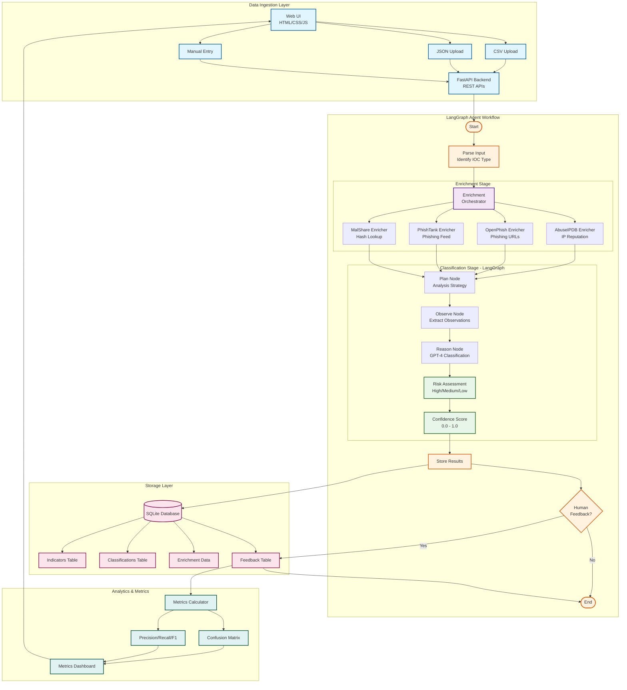
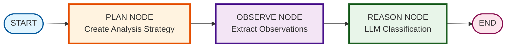
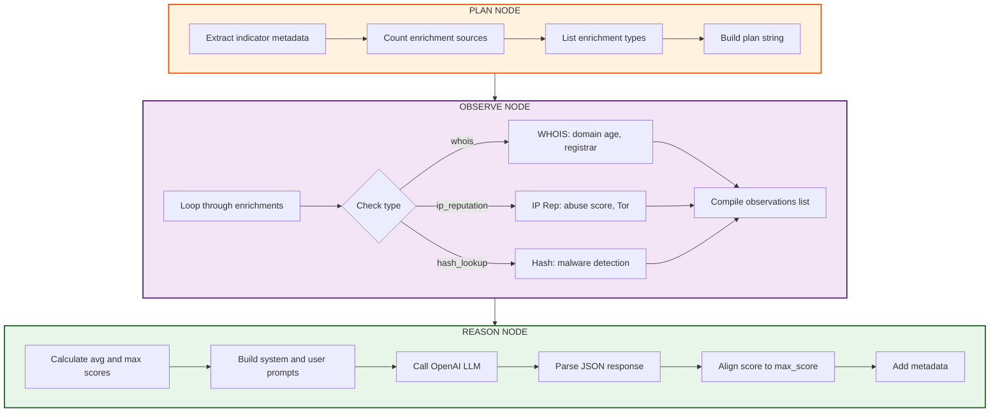

# 🛡️ Threat Analysis Agent

> **AI-Powered Threat Intelligence Platform with LangGraph Agent Architecture**

A production-ready threat analysis system that leverages OpenAI's GPT-4 and LangGraph to automatically classify, enrich, and assess cybersecurity indicators of compromise (IOCs).

[](https://www.python.org/)
[](https://fastapi.tiangolo.com/)
[](https://www.langchain.com/)
[](LICENSE)

---

## 📋 Table of Contents

- [Overview](#-overview)
- [Architecture](#-architecture)
- [Features](#-features)
- [Technology Stack](#-technology-stack)
- [Installation](#-installation)
- [Configuration](#-configuration)
- [Running the Application](#-running-the-application)
- [API Documentation](#-api-documentation)
- [Data Ingestion](#-data-ingestion)
- [Enrichment Sources](#-enrichment-sources)
- [Agent Graph Workflow](#-agent-graph-workflow)
- [Database Schema](#-database-schema)
- [Usage Examples](#-usage-examples)
- [Metrics & Analytics](#-metrics--analytics)
- [Troubleshooting](#-troubleshooting)
- [Development](#-development)
- [Contributing](#-contributing)
- [License](#-license)

---

## 🎯 Overview

The **Threat Analysis Agent** is an intelligent cybersecurity platform that automates the process of analyzing threat indicators using AI-powered classification and multi-source enrichment. Built on LangGraph's Plan-Observe-Reason architecture, it provides:

- **Automated IOC Classification**: AI-powered risk assessment using GPT-4 with structured reasoning
- **Multi-Source Enrichment**: AbuseIPDB (IP reputation), OpenPhish (phishing URLs), PhishTank (phishing feed), and MalShare (hash lookup)
- **Advanced Agent Workflow**: LangGraph state machine with Plan → Observe → Reason pattern
- **RESTful API**: Complete REST API with Swagger documentation
- **Interactive Dashboard**: Web-based UI with CSV upload and manual indicator submission
- **Feedback Loop**: Human-in-the-loop validation for continuous improvement with precision/recall metrics
- **Analytics Dashboard**: Real-time metrics with confusion matrix and performance indicators

### Use Cases

- **Security Operations Centers (SOCs)**: Automate initial triage of security alerts
- **Incident Response**: Quick assessment of IOCs during investigations
- **Threat Intelligence**: Enrich and classify threat feeds automatically
- **Security Research**: Analyze malware samples and suspicious indicators
- **Training & Education**: Learn about AI-driven security automation

---

## 🏗️ Architecture

### System Architecture Diagram



### Component Architecture

```
threat-analysis-agent/
│
├── app/
│   ├── main.py                    # FastAPI application & routes
│   ├── config.py                  # Configuration management
│   ├── logging_config.py          # Structured logging setup
│   │
│   ├── api/                       # REST API endpoints
│   │   ├── ingest.py             # CSV upload & manual ingestion APIs
│   │   ├── query.py              # Query, filtering & retrieval APIs
│   │   ├── classify.py           # Classification & batch processing APIs
│   │   └── feedback.py           # Feedback submission & metrics APIs
│   │
│   ├── storage/                   # Data persistence layer
│   │   ├── db.py                 # SQLAlchemy engine & session management
│   │   ├── models.py             # ORM models (Indicators, Classifications, Enrichments, Feedbacks, AgentRuns)
│   │   └── repository.py         # Data access layer with CRUD operations
│   │
│   ├── ingestion/                 # Data ingestion modules
│   │   ├── ingestor.py           # Base ingestion interface & data classes
│   │   └── csv_ingestor.py       # CSV file processing with auto-type detection
│   │
│   ├── enrichment/                # Threat intelligence enrichment
│   │   ├── base.py               # Base enricher interface & registry
│   │   ├── orchestrator.py       # Concurrent enrichment coordination
│   │   ├── abuseipdb_enricher.py # IP reputation with abuse scoring
│   │   ├── openphish_enricher.py # Phishing URL detection (feed cache)
│   │   ├── phishtank_enricher.py # Community phishing feed lookup
│   │   └── malshare_enricher.py  # Malware hash analysis
│   │
│   ├── classification/            # AI-powered classification
│   │   └── classifier.py         # ThreatClassifier wrapper for LangGraph agent
│   │
│   ├── langchain_graph/           # LangGraph agent implementation
│   │   └── graph_builder.py      # Plan-Observe-Reason state machine workflow
│   │
│   └── utils/                     # Utility functions
│       ├── helpers.py            # Type detection, normalization, sanitization
│       └── exceptions.py         # Custom exception classes
│
├── ui/                            # Web interface
│   ├── index.html                # Main dashboard
│   ├── metrics.html              # Analytics page
│   ├── styles.css                # Styling
│   └── app.js                    # Frontend logic
│
├── config.yaml                    # Application configuration
├── requirements.txt               # Python dependencies
├── .env.example                  # Environment variables template
└── README.md                     # This file
```

---

## ✨ Features

### Core Capabilities

- **🤖 AI-Powered Classification**: GPT-4 analyzes indicators and assigns risk levels (High/Medium/Low)
- **🔍 Multi-Source Enrichment**: Automatically enriches IOCs with data from multiple threat intelligence sources
- **📊 Real-Time Analytics**: Track classification performance with confusion matrix and accuracy metrics
- **💾 Persistent Storage**: SQLite database for indicator storage and historical analysis
- **🌐 RESTful API**: Complete REST API with automatic Swagger documentation
- **🎨 Interactive Dashboard**: Clean, responsive web interface built with vanilla HTML/CSS/JS
- **🔄 Feedback Loop**: Human validation to improve classification accuracy over time
- **📝 Structured Logging**: JSON-formatted logs for easy parsing and monitoring
- **⚡ Async Processing**: Non-blocking operations for better performance
- **🔐 Type Safety**: Pydantic models for data validation

### Advanced Features

- **Batch Processing**: Upload CSV files with multiple indicators
- **Confidence Scoring**: Each classification includes a confidence score (0.0-1.0)
- **Historical Analysis**: Query past classifications and enrichment data
- **Rate Limiting**: Built-in protection for external API calls
- **Error Recovery**: Graceful handling of enrichment failures
- **Extensible Architecture**: Easy to add new enrichment sources or classifiers

---

## 🛠️ Technology Stack

### Backend Technologies

| Component | Technology | Version | Purpose |
|-----------|-----------|---------|---------|
| **Framework** | FastAPI | 0.104+ | High-performance async web framework with automatic OpenAPI docs |
| **Server** | Uvicorn | Latest | ASGI server for running FastAPI |
| **Agent Framework** | LangGraph | 0.2+ | State machine orchestration for LLM agent workflows (Plan-Observe-Reason) |
| **LLM Integration** | LangChain | 0.1+ | LLM framework with OpenAI integration |
| **LLM** | OpenAI GPT-4o-mini | Latest | Fast, cost-effective AI for threat classification (also supports GPT-4) |
| **ORM** | SQLAlchemy | 2.0+ | Database abstraction, models, and migrations |
| **Database** | SQLite | 3.x | Lightweight embedded database (zero-config) |
| **Validation** | Pydantic | 2.0+ | Data validation, serialization, and settings management |
| **Configuration** | pydantic-settings | 2.0+ | Config management from YAML + environment variables |
| **HTTP Client** | aiohttp, httpx | Latest | Async HTTP requests for enrichment APIs |
| **CSV/Data** | Pandas | Latest | CSV parsing and data manipulation |
| **Logging** | python-json-logger | Latest | Structured JSON logging for production |
| **Scheduling** | APScheduler | 3.10+ | Background task scheduling for autonomous mode |
| **Utilities** | validators, tldextract | Latest | IP/domain validation and parsing |

### Frontend Technologies

| Component | Technology | Purpose |
|-----------|-----------|---------|
| **UI** | HTML5 | Semantic markup with forms, tables, modals |
| **Styling** | CSS3 with Bootstrap 5 | Modern responsive design, utility classes |
| **Scripting** | Vanilla JavaScript (ES6+) | Interactive functionality, fetch API, async/await |
| **Charts** | Chart.js 4.x | Real-time metrics visualization, confusion matrix |
| **Icons** | Bootstrap Icons | UI icons and visual indicators |

### External Enrichment APIs

| Service | Purpose | Endpoint | API Key Required |
|---------|---------|----------|-----------------|
| **AbuseIPDB** | IP reputation & abuse scoring | https://api.abuseipdb.com/api/v2/check | Yes (optional) |
| **OpenPhish** | Phishing URL detection | https://openphish.com/feed.txt | No |
| **PhishTank** | Community phishing feed | https://data.phishtank.com/data/online-valid.csv | No |
| **MalShare** | Malware hash lookup | https://malshare.com/api.php | Optional |

---

## 📦 Installation

### Prerequisites

- **Python 3.9+** (Python 3.10+ recommended)
- **pip** (Python package manager)
- **OpenAI API Key** (for GPT-4 access)
- **Internet Connection** (for enrichment APIs)

### Step 1: Clone or Extract

```bash
# If cloning from repository
git clone <repository-url>
cd threat-analysis-agent

# If extracting from archive
tar -xzf threat_agent_complete.tar.gz
cd threat_agent_complete
```

### Step 2: Create Virtual Environment (Recommended)

```bash
# Create virtual environment
python -m venv venv

# Activate virtual environment
# On Linux/Mac:
source venv/bin/activate

# On Windows:
venv\Scripts\activate
```

### Step 3: Install Dependencies

```bash
# Install all required packages
pip install -r requirements.txt
```


---

## ⚙️ Configuration

### Environment Variables

Create a `.env` file in the project root:

```bash
# Copy example file
cp .env.example .env

# Edit with your API key
nano .env  # or use your preferred editor
```

**Required Configuration:**

```ini
# OpenAI API Key (REQUIRED for AI classification)
OPENAI_API_KEY=sk-proj-your-actual-openai-api-key-here

# Database Configuration (Optional - defaults work fine)
DATABASE_PATH=threat_intelligence.db

# API Configuration (Optional)
API_HOST=0.0.0.0
API_PORT=8000

# Logging Configuration (Optional)
LOG_LEVEL=INFO
LOG_FORMAT=json
```

### Getting an OpenAI API Key

1. Visit [OpenAI Platform](https://platform.openai.com/api-keys)
2. Sign in or create an account
3. Navigate to "API Keys" section
4. Click "Create new secret key"
5. Copy the key and paste it into your `.env` file

**Important**: Keep your API key secure and never commit it to version control!


### Environment Variable Overrides

Environment variables in `.env` take precedence over `config.yaml` settings:

```bash
# Required
OPENAI_API_KEY=sk-proj-your-key-here

# Optional API Keys
ABUSEIPDB_API_KEY=your-abuseipdb-key
MALSHARE_API_KEY=your-malshare-key

# Optional Overrides
DATABASE_PATH=custom_database.db
OPENAI_MODEL=gpt-4
LOG_LEVEL=DEBUG
```

### Accessing Configuration in Code

```python
from app.config import config

# Access nested configuration
model_name = config.openai.model
db_path = config.database.path
high_threshold = config.classification.high_risk_threshold
```

---

## 🚀 Running the Application

### Quick Start

```bash
# Start the FastAPI server
uvicorn app.main:app --reload
```

The application will start on `http://localhost:8000`

### Production Mode

```bash
# Run without auto-reload
uvicorn app.main:app --host 0.0.0.0 --port 8000

# Run with multiple workers
uvicorn app.main:app --host 0.0.0.0 --port 8000 --workers 4

# Run in background
nohup uvicorn app.main:app --host 0.0.0.0 --port 8000 > server.log 2>&1 &
```

### Access Points

Once running, access:

- **Main Dashboard**: http://localhost:8000
- **API Documentation**: http://localhost:8000/docs
- **Alternative API Docs**: http://localhost:8000/redoc
- **Metrics Dashboard**: http://localhost:8000/metrics.html
- **OpenAPI Spec**: http://localhost:8000/openapi.json

### Verification

Test the server is running:

```bash
# Health check
curl http://localhost:8000/health

# Expected response:
{"status": "healthy"}
```

---

## 📚 API Documentation

### Complete API Reference

The system provides a comprehensive REST API with automatic Swagger documentation.

#### Base URL

```
http://localhost:8000/api
```

**Note**: All API endpoints are prefixed with `/api` (not `/api/v1`)

### Endpoints Overview

| Method | Endpoint | Description |
|--------|----------|-------------|
| **POST** | `/api/ingest` | Submit single indicator for ingestion |
| **POST** | `/api/ingest/upload-csv` | Upload CSV file with multiple indicators |
| **POST** | `/api/ingest/upload-json` | Upload JSON file with multiple indicators |
| **POST** | `/api/classify/{indicator_id}` | Classify specific indicator (run LangGraph agent) |
| **POST** | `/api/classify/batch` | Batch classify multiple indicators |
| **GET** | `/api/classify/stats` | Get classification statistics |
| **GET** | `/api/indicators` | List all indicators with pagination & filtering |
| **GET** | `/api/indicators/{id}` | Get specific indicator with enrichments |
| **GET** | `/api/indicators/{id}/enrichments` | Get enrichment data for specific indicator |
| **POST** | `/api/feedback/submit` | Submit human feedback on classification |
| **GET** | `/api/feedback/metrics` | Get performance metrics & confusion matrix |
| **GET** | `/health` | Health check endpoint |
| **GET** | `/api/config` | Get public configuration (no sensitive data) |

---

### 1. Ingest Single Indicator

Submit a single indicator for analysis.

**Endpoint**: `POST /api/ingest`

**Request Body**:
```json
{
  "value": "192.168.1.100",
  "type": "ip",
  "source": "manual",
  "metadata": {
    "severity": "high",
    "first_seen": "2024-10-22T10:00:00Z"
  }
}
```

**Response**:
```json
{
  "id": 1,
  "value": "192.168.1.100",
  "type": "ip",
  "source": "manual",
  "status": "pending",
  "created_at": "2024-10-22T10:00:00Z",
  "metadata": {
    "severity": "high",
    "first_seen": "2024-10-22T10:00:00Z"
  }
}
```

**cURL Example**:
```bash
curl -X POST http://localhost:8000/api/v1/ingest/single \
  -H "Content-Type: application/json" \
  -d '{
    "value": "192.168.1.100",
    "type": "ip",
    "source": "manual"
  }'
```

---

### 2. Batch Upload (CSV)

Upload a CSV file containing multiple indicators.

**Endpoint**: `POST /api/ingest/upload-csv`

**Request**: Multipart form data with file

**CSV Format**:
```csv
value,type,source,metadata
192.168.1.100,ip,firewall,"{\"severity\":\"high\"}"
example.com,domain,proxy,"{\"category\":\"phishing\"}"
44d88612fea8a8f36de82e1278abb02f,hash,endpoint,"{\"filename\":\"malware.exe\"}"
```

**Response**:
```json
{
  "total": 3,
  "successful": 3,
  "failed": 0,
  "indicators": [
    {
      "id": 1,
      "value": "192.168.1.100",
      "type": "ip",
      "status": "pending"
    },
    {
      "id": 2,
      "value": "example.com",
      "type": "domain",
      "status": "pending"
    },
    {
      "id": 3,
      "value": "44d88612fea8a8f36de82e1278abb02f",
      "type": "hash",
      "status": "pending"
    }
  ]
}
```

**cURL Example**:
```bash
curl -X POST http://localhost:8000/api/v1/ingest/batch \
  -F "file=@sample_indicators.csv"
```

---

### 3. Classify Indicator

Trigger AI classification for a specific indicator.

**Endpoint**: `POST /api/classify/{indicator_id}`

**Path Parameters**:
- `indicator_id` (integer): ID of the indicator to classify

**Response**:
```json
{
  "id": 1,
  "indicator_id": 1,
  "classification": "malicious",
  "risk_score": 0.85,
  "confidence": 0.92,
  "reasoning": "IP address associated with known botnet activity. High abuse confidence score from reputation services.",
  "enrichment_data": {
    "whois": {
      "registrar": "Example Registrar",
      "creation_date": "2020-01-01"
    },
    "ip_reputation": {
      "abuse_confidence_score": 87,
      "total_reports": 45
    },
    "geoip": {
      "country": "RU",
      "city": "Moscow"
    }
  },
  "classified_at": "2024-10-22T10:05:00Z"
}
```

**cURL Example**:
```bash
curl -X POST http://localhost:8000/api/v1/classify/1
```

---

### 4. Query Indicators

Retrieve all indicators with optional filtering.

**Endpoint**: `GET /api/indicators`

**Query Parameters**:
- `type` (string, optional): Filter by indicator type (ip, domain, hash, url)
- `classification` (string, optional): Filter by classification (malicious, benign, suspicious)
- `limit` (integer, optional): Number of results (default: 100)
- `offset` (integer, optional): Pagination offset (default: 0)

**Response**:
```json
{
  "total": 150,
  "limit": 100,
  "offset": 0,
  "indicators": [
    {
      "id": 1,
      "value": "192.168.1.100",
      "type": "ip",
      "source": "manual",
      "status": "classified",
      "classification": {
        "classification": "malicious",
        "risk_score": 0.85,
        "confidence": 0.92
      },
      "created_at": "2024-10-22T10:00:00Z"
    }
  ]
}
```

**cURL Examples**:
```bash
# Get all indicators
curl http://localhost:8000/api/v1/indicators

# Filter by type
curl http://localhost:8000/api/v1/indicators?type=ip

# Filter by classification
curl http://localhost:8000/api/v1/indicators?classification=malicious

# Pagination
curl http://localhost:8000/api/v1/indicators?limit=50&offset=100
```

---

### 5. Get Specific Indicator

Retrieve details of a specific indicator.

**Endpoint**: `GET /api/indicators/{id}`

**Path Parameters**:
- `id` (integer): Indicator ID

**Response**:
```json
{
  "id": 1,
  "value": "192.168.1.100",
  "type": "ip",
  "source": "manual",
  "status": "classified",
  "metadata": {
    "severity": "high"
  },
  "enrichment_data": {
    "whois": {...},
    "ip_reputation": {...},
    "geoip": {...}
  },
  "classification": {
    "classification": "malicious",
    "risk_score": 0.85,
    "confidence": 0.92,
    "reasoning": "..."
  },
  "created_at": "2024-10-22T10:00:00Z",
  "updated_at": "2024-10-22T10:05:00Z"
}
```

**cURL Example**:
```bash
curl http://localhost:8000/api/v1/indicators/1
```

---

### 6. Submit Feedback

Provide human validation feedback on a classification.

**Endpoint**: `POST /api/feedback/submit`

**Request Body**:
```json
{
  "indicator_id": 1,
  "is_correct": true,
  "actual_classification": "malicious",
  "comments": "Confirmed through manual analysis"
}
```

**Response**:
```json
{
  "id": 1,
  "indicator_id": 1,
  "is_correct": true,
  "actual_classification": "malicious",
  "comments": "Confirmed through manual analysis",
  "submitted_at": "2024-10-22T10:10:00Z"
}
```

**cURL Example**:
```bash
curl -X POST http://localhost:8000/api/v1/feedback \
  -H "Content-Type: application/json" \
  -d '{
    "indicator_id": 1,
    "is_correct": true,
    "actual_classification": "malicious"
  }'
```

---

### 7. Get Metrics

Retrieve performance metrics and confusion matrix.

**Endpoint**: `GET /api/feedback/metrics`

**Response**:
```json
{
  "total_classifications": 150,
  "total_feedback": 75,
  "accuracy": 0.92,
  "precision": 0.89,
  "recall": 0.94,
  "f1_score": 0.91,
  "confusion_matrix": {
    "true_positive": 65,
    "true_negative": 5,
    "false_positive": 3,
    "false_negative": 2
  },
  "by_classification": {
    "malicious": {
      "total": 80,
      "correct": 75,
      "accuracy": 0.94
    },
    "benign": {
      "total": 50,
      "correct": 45,
      "accuracy": 0.90
    },
    "suspicious": {
      "total": 20,
      "correct": 18,
      "accuracy": 0.90
    }
  }
}
```

**cURL Example**:
```bash
curl http://localhost:8000/api/v1/metrics
```

---

### Error Responses

All endpoints return standard HTTP status codes:

**400 Bad Request**:
```json
{
  "detail": "Invalid indicator type. Must be one of: ip, domain, hash, url"
}
```

**404 Not Found**:
```json
{
  "detail": "Indicator with ID 999 not found"
}
```

**500 Internal Server Error**:
```json
{
  "detail": "Classification failed: OpenAI API error"
}
```

---

## 📥 Data Ingestion

The system supports multiple methods for ingesting threat indicators.

### Method 1: Web Dashboard (Manual)

1. Navigate to http://localhost:8000
2. Click "Add Single Indicator"
3. Fill in the form:
   - **Value**: The indicator value (IP, domain, hash, URL)
   - **Type**: Select from dropdown (ip, domain, hash, url)
   - **Source**: Origin of the indicator (e.g., "firewall", "ids", "manual")
4. Click "Submit"
5. The indicator will be automatically classified

### Method 2: File Upload (CSV or JSON) - Batch

The system supports both **CSV** and **JSON** file uploads for batch indicator ingestion.

#### Option A: CSV Upload

**Endpoint**: `POST /api/ingest/upload-csv`

**CSV Format**:
```csv
value,indicator_type,source,tags,notes
192.168.1.100,ip,firewall,"scanning,ssh","Multiple SSH attempts"
example.com,domain,proxy,"phishing","Reported by user"
44d88612fea8a8f36de82e1278abb02f,hash,endpoint,"malware","Detected on workstation"
```

**Via Web UI**:
1. Navigate to http://localhost:8000
2. Click "Upload File" tab
3. Select your CSV file
4. Choose options:
   - ☑️ **Auto-enrich**: Automatically enrich all indicators
   - ☑️ **Auto-classify**: Automatically classify all indicators
5. Click "Upload CSV File"
6. View statistics: created, updated, failed counts

**Via cURL**:
```bash
curl -X POST "http://localhost:8000/api/ingest/upload-csv?enrich=true&classify=true" \
  -F "file=@indicators.csv"
```

#### Option B: JSON Upload

**Endpoint**: `POST /api/ingest/upload-json`

**JSON Format (Array of Objects)**:
```json
[
  {
    "value": "evil-domain.com",
    "indicator_type": "domain",
    "source": "manual",
    "tags": ["phishing", "malware"],
    "notes": "Reported by user"
  },
  {
    "value": "192.0.2.1",
    "indicator_type": "ip",
    "source": "feed",
    "tags": ["scanning"]
  }
]
```

**JSON Format (Single Object)**:
```json
{
  "value": "44d88612fea8a8f36de82e1278abb02f",
  "indicator_type": "hash",
  "source": "endpoint",
  "tags": ["malware"],
  "notes": "Detected on workstation"
}
```

**Via Web UI**:
1. Navigate to http://localhost:8000
2. Click "Upload File" tab
3. Select your JSON file
4. Choose enrichment/classification options
5. Click "Upload JSON File"

**Via cURL**:
```bash
curl -X POST "http://localhost:8000/api/ingest/upload-json?enrich=true&classify=true" \
  -F "file=@indicators.json"
```

### Method 3: REST API (Programmatic)

**Python Example**:
```python
import requests

# Single indicator
response = requests.post(
    "http://localhost:8000/api/ingest/submit",
    json={
        "value": "192.168.1.100",
        "indicator_type": "ip",
        "source": "python_script",
        "tags": ["scanning"],
        "notes": "Detected port scan"
    },
    params={"enrich": True, "classify": True}
)
indicator = response.json()
print(f"Indicator ID: {indicator['id']}, Risk: {indicator.get('risk_level')}")

# CSV upload
with open("indicators.csv", "rb") as f:
    response = requests.post(
        "http://localhost:8000/api/ingest/upload-csv?enrich=true&classify=true",
        files={"file": f}
    )
    result = response.json()
    print(f"Uploaded: {result['indicators_created']} created, {result['indicators_updated']} updated")

# JSON upload
with open("indicators.json", "rb") as f:
    response = requests.post(
        "http://localhost:8000/api/ingest/upload-json?enrich=true&classify=true",
        files={"file": f}
    )
    result = response.json()
    print(f"Uploaded: {result['indicators_created']} created, {result['indicators_updated']} updated")
```

**JavaScript Example**:
```javascript
// Single indicator
fetch('http://localhost:8000/api/ingest/submit?enrich=true&classify=true', {
    method: 'POST',
    headers: {
        'Content-Type': 'application/json'
    },
    body: JSON.stringify({
        value: '192.168.1.100',
        indicator_type: 'ip',
        source: 'javascript_app',
        tags: ['scanning'],
        notes: 'Detected from firewall logs'
    })
})
.then(response => response.json())
.then(data => console.log(`Created: ${data.id}, Risk: ${data.risk_level}`));

// CSV upload
const csvFormData = new FormData();
csvFormData.append('file', csvFileInput.files[0]);

fetch('http://localhost:8000/api/ingest/upload-csv?enrich=true&classify=true', {
    method: 'POST',
    body: csvFormData
})
.then(response => response.json())
.then(data => console.log(`Uploaded ${data.indicators_created} indicators from CSV`));

// JSON upload
const jsonFormData = new FormData();
jsonFormData.append('file', jsonFileInput.files[0]);

fetch('http://localhost:8000/api/ingest/upload-json?enrich=true&classify=true', {
    method: 'POST',
    body: jsonFormData
})
.then(response => response.json())
.then(data => console.log(`Uploaded ${data.indicators_created} indicators from JSON`));
```

**Sample Data**

A sample CSV file is provided: `sample_indicators.csv`

```csv
value,type,source,metadata
8.8.8.8,ip,test,"{\"note\":\"Google DNS\"}"
malicious-site.com,domain,test,"{\"note\":\"Known phishing\"}"
44d88612fea8a8f36de82e1278abb02f,hash,test,"{\"note\":\"Test malware hash\"}"
```

---

## 🔍 Enrichment Sources

The system automatically enriches indicators with data from multiple threat intelligence sources using concurrent async operations.

### 1. AbuseIPDB Enricher

**Provider**: AbuseIPDB API
**Endpoint**: https://api.abuseipdb.com/api/v2/check
**Implementation**: `app/enrichment/abuseipdb_enricher.py`
**Applies To**: IP address indicators (IPv4 and IPv6)
**API Key**: Required for full access (set ABUSEIPDB_API_KEY in .env)

**Data Collected**:
- **Abuse Confidence Score** (0-100): Community-driven risk assessment
- **Total Reports**: Number of abuse reports submitted
- **Country Code**: Geographic location of IP
- **ISP Information**: Internet Service Provider details
- **Usage Type**: Data center, residential, mobile, etc.
- **Tor/Proxy Detection**: Whether IP is associated with anonymization services
- **Whitelist Status**: If IP is on AbuseIPDB whitelist
- **Last Reported Date**: Most recent abuse report timestamp

**Example Output**:
```json
{
  "abuseConfidenceScore": 92,
  "totalReports": 156,
  "countryCode": "RU",
  "usageType": "Data Center/Web Hosting/Transit",
  "isp": "Suspicious Hosting Ltd",
  "isTor": false,
  "isWhitelisted": false,
  "lastReportedAt": "2024-10-24T09:30:00+00:00"
}
```

**Risk Scoring**:
- 0-25: Low risk (score 0-2)
- 26-50: Medium risk (score 3-5)
- 51-75: High risk (score 6-8)
- 76-100: Critical risk (score 8-10)

**Rate Limits**: 1,000 requests/day (free tier), 100,000/day (paid)
**Fallback**: Returns empty dict with score 0 if API unavailable
**Caching**: No caching, real-time checks

---

### 2. OpenPhish Enricher

**Provider**: OpenPhish Community
**Feed URL**: https://openphish.com/feed.txt
**Implementation**: `app/enrichment/openphish_enricher.py`
**Applies To**: URLs and domain indicators
**API Key**: Not required (free public feed)

**Data Collected**:
- **Phishing Status**: Whether URL/domain is in active phishing feed
- **Feed Size**: Total number of phishing URLs in current feed
- **Cache Timestamp**: When feed was last refreshed
- **Match Status**: Exact match or domain-level match

**Example Output**:
```json
{
  "is_phishing": true,
  "matched_url": "http://malicious-site.com/login",
  "feed_size": 15432,
  "last_updated": "2024-10-24T10:00:00Z",
  "cache_status": "fresh"
}
```

**Risk Scoring**:
- Listed in feed: High risk (score 8.0)
- Not listed: Low risk (score 1.0)

**Rate Limits**: None (uses cached feed)
**Fallback**: Returns negative result if feed unavailable
**Caching**: 15-minute TTL (time-to-live) for feed data

---

### 3. PhishTank Enricher

**Provider**: PhishTank Community
**Feed URL**: https://data.phishtank.com/data/online-valid.csv
**Implementation**: `app/enrichment/phishtank_enricher.py`
**Applies To**: URL indicators only
**API Key**: Not required (free public feed)

**Data Collected**:
- **Verification Status**: Community verification state
- **Submission Date**: When phishing URL was first reported
- **PhishTank ID**: Unique identifier in PhishTank database
- **Valid Status**: Whether phish is still active
- **Target**: Brand or service being impersonated (if available)
- **Detail URL**: Link to PhishTank details page

**Example Output**:
```json
{
  "is_verified_phish": true,
  "phish_id": "8234567",
  "submission_time": "2024-10-23T14:20:00Z",
  "verification_time": "2024-10-23T14:45:00Z",
  "online": true,
  "target": "PayPal",
  "phish_detail_url": "https://www.phishtank.com/phish_detail.php?phish_id=8234567"
}
```

**Risk Scoring**:
- Verified phishing: High risk (score 9.0)
- Unverified/pending: Medium risk (score 5.0)
- Not found: Low risk (score 1.0)

**Rate Limits**: None (uses cached CSV feed)
**Fallback**: Returns negative result if feed unavailable
**Caching**: 1-hour TTL (configurable) for feed data

---

### 4. MalShare Enricher

**Provider**: MalShare API
**Endpoint**: https://malshare.com/api.php
**Implementation**: `app/enrichment/malshare_enricher.py`
**Applies To**: File hash indicators (MD5, SHA1, SHA256)
**API Key**: Optional (improves rate limits)

**Supported Hash Formats**:
- **MD5**: 32 hexadecimal characters
- **SHA1**: 40 hexadecimal characters
- **SHA256**: 64 hexadecimal characters

**Data Collected**:
- **Detection Status**: Whether hash is known malware
- **File Type**: PE32, ELF, PDF, Office document, etc.
- **Malware Family**: Classification if detected
- **File Size**: Size in bytes
- **First Seen**: Initial upload timestamp
- **Sources**: Where sample was obtained

**Example Output**:
```json
{
  "md5": "44d88612fea8a8f36de82e1278abb02f",
  "sha1": "3395856ce81f2b7382dee72602f798b642f14140",
  "sha256": "275a021bbfb6489e54d471899f7db9d1663fc695ec2fe2a2c4538aabf651fd0f",
  "type": "PE32 executable",
  "detected": true,
  "malware_family": "Emotet",
  "file_size": 245760,
  "first_seen": "2024-09-15T08:20:00Z"
}
```

**Risk Scoring**:
- Known malware: Critical risk (score 9.0-10.0)
- Suspicious patterns: Medium risk (score 5.0-7.0)
- Not found: Neutral (score 0, requires further analysis)

**Rate Limits**: Varies by API key tier (100/hour free, 1000/hour with key)
**Fallback**: Returns basic hash validation if API unavailable
**SSL Handling**: Custom SSL context to handle certificate issues

---

### Enrichment Configuration

Control enrichment behavior in `config.yaml`:

```yaml
enrichment:
  timeout: 30              # Seconds to wait for each enricher
  max_retries: 3           # Number of retry attempts on failure
  retry_delay: 2           # Seconds to wait between retries
  concurrent_limit: 5      # Max concurrent enrichment tasks
```

**Orchestration Features**:
- **Concurrent Execution**: Enrichers run in parallel using asyncio.Semaphore
- **Timeout Handling**: Each enricher has a 30-second timeout
- **Retry Logic**: Automatic retries with configurable delays
- **Error Recovery**: Failed enrichers don't block classification
- **Automatic Selection**: Enrichers chosen based on indicator type
- **Result Storage**: All enrichment data stored in database

---

## 🤖 Agent Graph Workflow

The system uses **LangGraph** to orchestrate the analysis workflow as a **Plan → Observe → Reason** state machine.

### Complete LangGraph Workflow (Actual Implementation)

**Visual Workflow Diagram:**



**Detailed Node Breakdown:**



### Simplified State Machine Overview

```
┌─────────────────────────────────┐
│          START                  │
│  • indicator: {type, value}     │
│  • enrichments: [...]           │
└────────────┬────────────────────┘
             │
             ▼
┌─────────────────────────────────┐
│       PLAN NODE                 │
│  _plan_node(state)              │
├─────────────────────────────────┤
│  Input: indicator, enrichments  │
│  Process:                       │
│   • Extract metadata            │
│   • Count enrichment sources    │
│   • List enrichment types       │
│  Output: plan (str)             │
└────────────┬────────────────────┘
             │
             ▼
┌─────────────────────────────────┐
│      OBSERVE NODE               │
│  _observe_node(state)           │
├─────────────────────────────────┤
│  Input: enrichments             │
│  Process:                       │
│   Loop each enrichment:         │
│    ├─ WHOIS → domain age,       │
│    │   registrar, country       │
│    ├─ IP Reputation → abuse     │
│    │   score, reports, Tor      │
│    └─ Hash Lookup → malware     │
│       detection, families       │
│  Output: observations (List)    │
└────────────┬────────────────────┘
             │
             ▼
┌─────────────────────────────────┐
│       REASON NODE (LLM)         │
│  _reason_node(state)            │
├─────────────────────────────────┤
│  Input: plan, observations      │
│  Process:                       │
│   1. Calculate avg & max scores │
│   2. Build system + user prompt │
│   3. Call LLM (gpt-4o-mini)     │
│   4. Parse JSON response        │
│   5. Align score to max_score   │
│   6. Add metadata               │
│  Output: classification (dict)  │
│   ├─ risk_level: high/med/low   │
│   ├─ risk_score: 0-10           │
│   ├─ confidence: 0-1            │
│   ├─ reasoning: str             │
│   └─ key_factors: [...]         │
└────────────┬────────────────────┘
             │
             ▼
┌─────────────┐
│     END     │
└─────────────┘
```

---

## 💾 Database Schema

The system uses **SQLite** with SQLAlchemy ORM. The database is automatically created on first run at `threat_intelligence.db`.

### Tables Overview

The schema consists of **5 main tables**:

1. **indicators** - Stores all ingested threat indicators
2. **enrichments** - Stores enrichment data from threat intelligence sources
3. **classifications** - Stores AI-powered classification results
4. **feedbacks** - Stores human feedback for model validation
5. **agent_runs** - Tracks autonomous agent execution history

### Detailed Schema

#### 1. `indicators` Table
Stores all ingested threat indicators with metadata.

| Column | Type | Constraints | Description |
|--------|------|-------------|-------------|
| `id` | INTEGER | PRIMARY KEY, AUTOINCREMENT | Unique identifier |
| `indicator_type` | TEXT | NOT NULL | Enum: 'ip', 'domain', 'hash', 'url', 'email' |
| `value` | TEXT | NOT NULL, UNIQUE | The actual indicator value |
| `source_type` | TEXT | | Origin type: 'csv_upload', 'feed', 'manual', 'api' |
| `source_name` | TEXT | | Human-readable source name |
| `source_url` | TEXT | | Optional reference URL |
| `first_seen` | DATETIME | | Initial detection timestamp |
| `last_seen` | DATETIME | | Most recent detection |
| `raw_data` | JSON | | Original raw data |
| `tags` | JSON | | List of tags (e.g., ["malware", "phishing"]) |
| `notes` | TEXT | | Additional notes or context |
| `is_active` | BOOLEAN | DEFAULT TRUE | Whether indicator is active |
| `created_at` | DATETIME | DEFAULT CURRENT_TIMESTAMP | Record creation time |
| `updated_at` | DATETIME | DEFAULT CURRENT_TIMESTAMP | Last update time |

**Indexes**:
- `idx_indicators_type` on `indicator_type`
- `idx_indicators_value` on `value`
- `idx_indicators_source_type` on `source_type`
- `idx_indicators_first_seen` on `first_seen`
- `idx_indicators_is_active` on `is_active`


#### 2. `enrichments` Table
Stores enrichment data from various threat intelligence sources.

| Column | Type | Constraints | Description |
|--------|------|-------------|-------------|
| `id` | INTEGER | PRIMARY KEY, AUTOINCREMENT | Unique identifier |
| `indicator_id` | INTEGER | NOT NULL, FOREIGN KEY → indicators(id) | Reference to indicator |
| `enrichment_type` | TEXT | NOT NULL | Type: 'abuseipdb', 'openphish', 'phishtank', 'malshare' |
| `provider` | TEXT | NOT NULL | Service provider name |
| `data` | JSON | NOT NULL | Enrichment result data (structure varies by type) |
| `score` | REAL | | Risk score (0.0-10.0) calculated from enrichment |
| `enriched_at` | DATETIME | DEFAULT CURRENT_TIMESTAMP | When enrichment was performed |
| `success` | BOOLEAN | DEFAULT TRUE | Whether enrichment succeeded |
| `error_message` | TEXT | | Error details if enrichment failed |

**Foreign Keys**:
- `indicator_id` → `indicators(id)` ON DELETE CASCADE

**Indexes**:
- `idx_enrichments_indicator_id` on `indicator_id`
- `idx_enrichments_type` on `enrichment_type`
- `idx_enrichments_enriched_at` on `enriched_at`


#### 3. `classifications` Table
Stores AI-powered classification results from the LangGraph agent.

| Column | Type | Constraints | Description |
|--------|------|-------------|-------------|
| `id` | INTEGER | PRIMARY KEY, AUTOINCREMENT | Unique identifier |
| `indicator_id` | INTEGER | NOT NULL, FOREIGN KEY → indicators(id) | Reference to indicator |
| `risk_level` | TEXT | NOT NULL | Enum: 'high', 'medium', 'low', 'unknown' |
| `risk_score` | REAL | NOT NULL | Numeric score (0.0-10.0) |
| `confidence` | REAL | NOT NULL | AI confidence level (0.0-1.0) |
| `reasoning` | TEXT | | Detailed reasoning from LLM |
| `factors` | JSON | | Key factors that influenced decision (List[str]) |
| `model_name` | TEXT | | Model used (e.g., 'gpt-4o-mini', 'gpt-4') |
| `model_version` | TEXT | | Model version identifier |
| `classified_at` | DATETIME | DEFAULT CURRENT_TIMESTAMP | When classification was performed |

**Foreign Keys**:
- `indicator_id` → `indicators(id)` ON DELETE CASCADE

**Indexes**:
- `idx_classifications_indicator_id` on `indicator_id`
- `idx_classifications_risk_level` on `risk_level`
- `idx_classifications_classified_at` on `classified_at`


#### 4. `feedbacks` Table
Stores human validation feedback for classification accuracy tracking.

| Column | Type | Constraints | Description |
|--------|------|-------------|-------------|
| `id` | INTEGER | PRIMARY KEY, AUTOINCREMENT | Unique identifier |
| `indicator_id` | INTEGER | NOT NULL, FOREIGN KEY → indicators(id) | Reference to indicator |
| `original_risk_level` | TEXT | | What AI originally predicted |
| `feedback_type` | TEXT | NOT NULL | Enum: 'true_positive', 'false_positive', 'true_negative', 'false_negative', 'correction' |
| `corrected_risk_level` | TEXT | | Corrected classification if AI was wrong |
| `comment` | TEXT | | User comments and notes |
| `user_id` | TEXT | | Optional user identifier for tracking |
| `created_at` | DATETIME | DEFAULT CURRENT_TIMESTAMP | When feedback was submitted |

**Foreign Keys**:
- `indicator_id` → `indicators(id)` ON DELETE CASCADE

**Indexes**:
- `idx_feedbacks_indicator_id` on `indicator_id`
- `idx_feedbacks_type` on `feedback_type`
- `idx_feedbacks_created_at` on `created_at`


#### 5. `agent_runs` Table
Tracks autonomous agent execution history and statistics.

| Column | Type | Constraints | Description |
|--------|------|-------------|-------------|
| `id` | INTEGER | PRIMARY KEY, AUTOINCREMENT | Unique identifier |
| `run_type` | TEXT | NOT NULL | Type: 'autonomous', 'manual' |
| `status` | TEXT | NOT NULL | Status: 'running', 'completed', 'failed' |
| `indicators_processed` | INTEGER | DEFAULT 0 | Total indicators processed |
| `indicators_new` | INTEGER | DEFAULT 0 | New indicators created |
| `indicators_updated` | INTEGER | DEFAULT 0 | Existing indicators updated |
| `enrichments_performed` | INTEGER | DEFAULT 0 | Total enrichments performed |
| `classifications_created` | INTEGER | DEFAULT 0 | Total classifications created |
| `errors_count` | INTEGER | DEFAULT 0 | Number of errors encountered |
| `error_details` | JSON | | List of error messages and details |
| `started_at` | DATETIME | | When run started |
| `completed_at` | DATETIME | | When run completed |
| `duration_seconds` | REAL | | Total execution time in seconds |
| `config_snapshot` | JSON | | Configuration at time of run |

**Indexes**:
- `idx_agent_runs_status` on `status`
- `idx_agent_runs_started_at` on `started_at`

### Entity Relationships

```
indicators (1) ──────< (many) enrichments
    │
    ├──────< (many) classifications
    │
    └──────< (many) feedbacks

agent_runs (standalone, tracks execution history)
```

### Enumeration Types

**IndicatorType**:
- `ip` - IP address (IPv4 or IPv6)
- `domain` - Domain name
- `hash` - File hash (MD5, SHA1, SHA256)
- `url` - Full URL
- `email` - Email address

**RiskLevel**:
- `high` - High risk (score >= 7.0)
- `medium` - Medium risk (score 4.0-6.9)
- `low` - Low risk (score < 4.0)
- `unknown` - Unable to determine

**FeedbackType**:
- `true_positive` - Correctly identified as high risk
- `false_positive` - Incorrectly identified as high risk
- `true_negative` - Correctly identified as low risk
- `false_negative` - Incorrectly identified as low risk
- `correction` - General correction with new risk level

---

## 📖 Usage Examples

### Example 1: Analyzing a Suspicious IP

```bash
# 1. Submit IP for analysis
curl -X POST http://localhost:8000/api/v1/ingest/single \
  -H "Content-Type: application/json" \
  -d '{
    "value": "185.220.101.1",
    "type": "ip",
    "source": "firewall_alert"
  }'

# Response: {"id": 1, "value": "185.220.101.1", ...}

# 2. Trigger classification
curl -X POST http://localhost:8000/api/v1/classify/1

# 3. View results
curl http://localhost:8000/api/v1/indicators/1

# Example response showing enrichment + classification:
{
  "id": 1,
  "value": "185.220.101.1",
  "type": "ip",
  "enrichment_data": {
    "ip_reputation": {
      "abuseConfidenceScore": 92,
      "totalReports": 156
    },
    "geoip": {
      "country": "NL",
      "city": "Amsterdam",
      "org": "Suspicious Hosting Ltd"
    }
  },
  "classification": {
    "classification": "malicious",
    "risk_score": 0.92,
    "confidence": 0.95,
    "reasoning": "High abuse confidence score (92/100) with 156 reports. Associated with known malicious hosting provider."
  }
}
```

### Example 2: Batch Analysis from CSV

```python
# create_report.py
import requests
import pandas as pd
from datetime import datetime

# Upload indicators
with open('daily_indicators.csv', 'rb') as f:
    response = requests.post(
        'http://localhost:8000/api/v1/ingest/batch',
        files={'file': f}
    )
    
result = response.json()
print(f"Processed {result['successful']} indicators")

# Wait for classification (in production, use webhooks/callbacks)
import time
time.sleep(5)

# Get all malicious indicators
response = requests.get(
    'http://localhost:8000/api/v1/indicators',
    params={'classification': 'malicious'}
)

malicious = response.json()

# Generate report
report = pd.DataFrame(malicious['indicators'])
report.to_csv(f'malicious_report_{datetime.now().strftime("%Y%m%d")}.csv')
print(f"Report generated with {len(report)} malicious indicators")
```

### Example 3: Integration with Python

```python
# threat_hunter.py
import requests
from typing import List, Dict

class ThreatAnalysisClient:
    def __init__(self, base_url: str = "http://localhost:8000"):
        self.base_url = base_url
        
    def analyze_indicator(self, value: str, type: str, source: str = "api") -> Dict:
        """Submit and classify a single indicator."""
        # Ingest
        response = requests.post(
            f"{self.base_url}/api/v1/ingest/single",
            json={"value": value, "type": type, "source": source}
        )
        indicator = response.json()
        
        # Classify
        requests.post(f"{self.base_url}/api/v1/classify/{indicator['id']}")
        
        # Get results
        response = requests.get(
            f"{self.base_url}/api/v1/indicators/{indicator['id']}"
        )
        return response.json()
    
    def batch_analyze(self, indicators: List[Dict]) -> List[Dict]:
        """Analyze multiple indicators."""
        results = []
        for ind in indicators:
            result = self.analyze_indicator(
                value=ind['value'],
                type=ind['type'],
                source=ind.get('source', 'batch')
            )
            results.append(result)
        return results
    
    def get_malicious_indicators(self) -> List[Dict]:
        """Get all indicators classified as malicious."""
        response = requests.get(
            f"{self.base_url}/api/v1/indicators",
            params={"classification": "malicious"}
        )
        return response.json()['indicators']

# Usage
client = ThreatAnalysisClient()

# Analyze single indicator
result = client.analyze_indicator("evil.com", "domain", "threat_intel_feed")
print(f"Risk Score: {result['classification']['risk_score']}")

# Batch analysis
suspicious_ips = [
    {"value": "192.168.1.100", "type": "ip"},
    {"value": "10.0.0.50", "type": "ip"},
]
results = client.batch_analyze(suspicious_ips)

# Get all malicious finds
threats = client.get_malicious_indicators()
for threat in threats:
    print(f"⚠️ {threat['value']} - Risk: {threat['classification']['risk_score']}")
```

---

## 📊 Metrics & Analytics

### Metrics Dashboard

Access at: http://localhost:8000/metrics.html

**Displays**:
- **Confusion Matrix**: Visual representation of classification accuracy
- **Precision**: Percentage of true positives among all positive predictions
- **Recall**: Percentage of actual positives correctly identified
- **F1 Score**: Harmonic mean of precision and recall
- **Accuracy by Type**: Breakdown by indicator type (IP, domain, hash)

### Confusion Matrix

```
                  Predicted
                Mal   Ben   Sus
    Actual Mal   TP    FN    FN
           Ben   FP    TN    FN
           Sus   FP    FN    TP
```

Where:
- **TP (True Positive)**: Correctly identified as malicious
- **TN (True Negative)**: Correctly identified as benign
- **FP (False Positive)**: Incorrectly identified as malicious
- **FN (False Negative)**: Incorrectly identified as benign

### Metrics API

**Endpoint**: `GET /api/v1/metrics`

**Response**:
```json
{
  "total_classifications": 500,
  "total_feedback": 250,
  "accuracy": 0.94,
  "precision": 0.91,
  "recall": 0.96,
  "f1_score": 0.93,
  "confusion_matrix": {
    "true_positive": 200,
    "true_negative": 35,
    "false_positive": 10,
    "false_negative": 5
  },
  "by_type": {
    "ip": {"accuracy": 0.95, "total": 200},
    "domain": {"accuracy": 0.93, "total": 150},
    "hash": {"accuracy": 0.92, "total": 100},
    "url": {"accuracy": 0.90, "total": 50}
  }
}
```

---

## 🔧 Troubleshooting

### Common Issues

#### 1. OpenAI API Key Error

**Error**: `openai.error.AuthenticationError: Invalid API key`

**Solution**:
```bash
# Check your .env file
cat .env | grep OPENAI_API_KEY

# Verify format (should start with sk-proj- or sk-)
# Make sure there are no extra spaces or quotes

# Restart the server after fixing
uvicorn app.main:app --reload
```

#### 2. Database Locked Error

**Error**: `sqlite3.OperationalError: database is locked`

**Solution**:
```bash
# Stop all running instances
pkill -f uvicorn

# Remove lock file if it exists
rm threat_intelligence.db-journal

# Restart
uvicorn app.main:app --reload
```

#### 3. SSL Certificate Error (MalShare)

**Error**: `ssl.SSLError: certificate verify failed`

**Solution**: Already handled in code with SSL context bypass for MalShare API.

If still occurring:
```python
# In app/enrichment/malshare_enricher.py
ssl_context = ssl.create_default_context()
ssl_context.check_hostname = False
ssl_context.verify_mode = ssl.CERT_NONE
```

#### 4. Port Already in Use

**Error**: `OSError: [Errno 48] Address already in use`

**Solution**:
```bash
# Find process using port 8000
lsof -i :8000

# Kill the process
kill -9 <PID>

# Or use a different port
uvicorn app.main:app --port 8001
```

#### 5. Missing Dependencies

**Error**: `ModuleNotFoundError: No module named 'xxx'`

**Solution**:
```bash
# Reinstall all dependencies
pip install -r requirements.txt --force-reinstall

# Or install specific package
pip install xxx
```

### Logging

Check logs for debugging:

```bash
# View real-time logs
tail -f threat_agent.log

# Search for errors
grep "ERROR" threat_agent.log

# View JSON logs
cat threat_agent.log | jq '.level == "ERROR"'
```

---

## 👨‍💻 Development

### Project Structure Philosophy

- **Modular Design**: Each component is independent and testable
- **Separation of Concerns**: API, business logic, and data layers are distinct
- **Type Safety**: Pydantic models for validation
- **Async First**: Non-blocking I/O for better performance
- **Configuration-Driven**: Easy to modify behavior without code changes

### Adding New Features

**1. New Enrichment Source**:
```python
# app/enrichment/new_enricher.py
from app.enrichment.base import BaseEnricher

class NewEnricher(BaseEnricher):
    async def enrich(self, value: str, type: str) -> dict:
        if type != "ip":
            return {}
        # Your enrichment logic
        return {"new_data": "value"}
```

**2. New API Endpoint**:
```python
# app/api/new_endpoint.py
from fastapi import APIRouter

router = APIRouter()

@router.get("/custom")
async def custom_endpoint():
    return {"message": "Custom endpoint"}
```

**3. Custom Classifier**:
```python
# app/classification/custom_classifier.py
from app.classification.classifier import ClassificationResult

class CustomClassifier:
    async def classify(self, indicator: dict) -> ClassificationResult:
        # Your classification logic
        return ClassificationResult(
            classification="malicious",
            risk_score=0.8,
            confidence=0.9,
            reasoning="Custom logic"
        )
```

### Code Style

Follow PEP 8 and use type hints:

```python
from typing import List, Dict, Optional

async def process_indicators(
    indicators: List[Dict],
    batch_size: int = 100
) -> Dict[str, int]:
    """
    Process indicators in batches.
    
    Args:
        indicators: List of indicator dictionaries
        batch_size: Number of indicators per batch
        
    Returns:
        Dictionary with processing statistics
    """
    # Implementation
    pass
```
---

## 📄 License

This project is licensed under the MIT License - see the LICENSE file for details.

```
MIT License

Copyright (c) 2024 Threat Analysis Agent

Permission is hereby granted, free of charge, to any person obtaining a copy
of this software and associated documentation files (the "Software"), to deal
in the Software without restriction, including without limitation the rights
to use, copy, modify, merge, publish, distribute, sublicense, and/or sell
copies of the Software, and to permit persons to whom the Software is
furnished to do so, subject to the following conditions:

The above copyright notice and this permission notice shall be included in all
copies or substantial portions of the Software.

THE SOFTWARE IS PROVIDED "AS IS", WITHOUT WARRANTY OF ANY KIND, EXPRESS OR
IMPLIED, INCLUDING BUT NOT LIMITED TO THE WARRANTIES OF MERCHANTABILITY,
FITNESS FOR A PARTICULAR PURPOSE AND NONINFRINGEMENT. IN NO EVENT SHALL THE
AUTHORS OR COPYRIGHT HOLDERS BE LIABLE FOR ANY CLAIM, DAMAGES OR OTHER
LIABILITY, WHETHER IN AN ACTION OF CONTRACT, TORT OR OTHERWISE, ARISING FROM,
OUT OF OR IN CONNECTION WITH THE SOFTWARE OR THE USE OR OTHER DEALINGS IN THE
SOFTWARE.
```


---

## 🎓 Acknowledgments

- **LangChain/LangGraph**: For the state machine framework
- **OpenAI**: For GPT-4 API
- **FastAPI**: For the excellent web framework
- **AbuseIPDB, MalShare, ipapi.co**: For free threat intelligence APIs

---

## 📚 Additional Resources

### Documentation
- [FastAPI Docs](https://fastapi.tiangolo.com/)
- [LangChain Docs](https://python.langchain.com/)
- [SQLAlchemy Docs](https://docs.sqlalchemy.org/)
- [OpenAI API Docs](https://platform.openai.com/docs/)

### Threat Intelligence
- [MITRE ATT&CK](https://attack.mitre.org/)
- [STIX/TAXII](https://oasis-open.github.io/cti-documentation/)
- [NIST Cybersecurity Framework](https://www.nist.gov/cyberframework)

### Security Best Practices
- [OWASP Top 10](https://owasp.org/www-project-top-ten/)
- [CIS Controls](https://www.cisecurity.org/controls/)

---

<div align="center">

**Built with ❤️ for the Cybersecurity Community**

[](https://github.com/your-repo)
[](https://docs.threat-agent.example.com)
[](http://localhost:8000/docs)

</div>

---

**Happy Threat Hunting! 🔍🛡️**